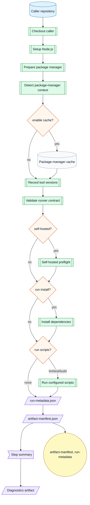
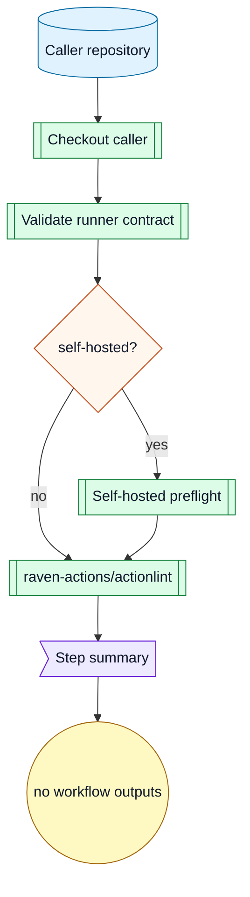
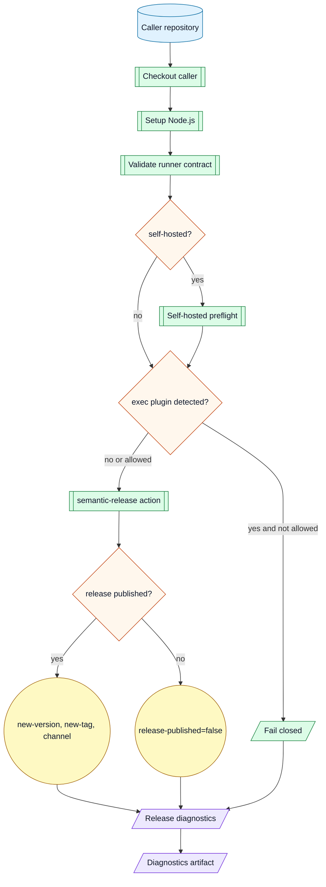
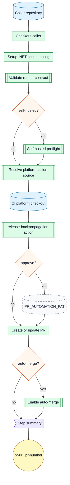
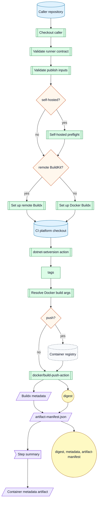
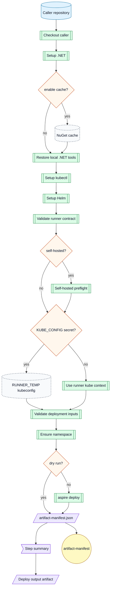
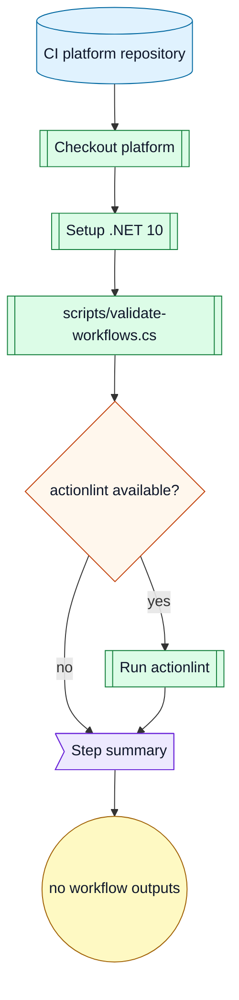

```mermaid
flowchart TD
  caller[("Caller repository")] --> checkout[[Checkout caller]]
  checkout --> tooling[[Setup .NET action tooling]]
  tooling --> sdk{global.json?}
  sdk -->|yes| global[[Setup .NET from global.json]]
  sdk -->|no| version[[Setup .NET from dotnet-version]]
  global --> cache[("NuGet cache")]
  version --> cache
  cache --> validate[[Validate runner contract]]
  validate --> preflight{self-hosted?}
  preflight -->|yes| sh[[Self-hosted preflight]]
  preflight -->|no| restoreTools[[Restore local .NET tools]]
  sh --> restoreTools
  restoreTools --> restore[[Restore dependencies]]
  restore --> format{verify format?}
  format -->|yes| fmt[[dotnet format]]
  format -->|no| build[[Build with binlog]]
  fmt --> build
  build --> tests{run tests?}
  tests -->|yes| test[[Test and collect coverage]]
  tests -->|no| coverage{coverage report?}
  test --> coverage
  coverage -->|yes| platform[("CI platform checkout")]
  platform --> report[[dotnet-coverage-report action]]
  coverage -->|no| metadata[/run-metadata.json/]
  report --> metadata
  metadata --> manifest[/artifact-manifest.json/]
  manifest --> summary>Step summary]
  summary --> diagnostics[/Diagnostics artifact/]
  manifest --> outputs(("artifact-manifest, run-metadata"))
  classDef repo fill:#e0f2fe,stroke:#0369a1,color:#0f172a
  classDef action fill:#dcfce7,stroke:#15803d,color:#0f172a
  classDef decision fill:#fff7ed,stroke:#c2410c,color:#0f172a
  classDef artifact fill:#ede9fe,stroke:#6d28d9,color:#0f172a
  classDef output fill:#fef9c3,stroke:#a16207,color:#0f172a
  classDef external fill:#f8fafc,stroke:#475569,stroke-dasharray: 4 3,color:#0f172a
  class caller,platform repo
  class checkout,tooling,global,version,validate,sh,restoreTools,restore,fmt,build,test,report action
  class sdk,preflight,format,tests,coverage decision
  class metadata,manifest,summary,diagnostics artifact
  class outputs output
  class cache external
```

```mermaid
flowchart TD
  caller[("Caller repository")] --> checkout[[Checkout caller]]
  checkout --> dotnet[[Setup .NET]]
  dotnet --> cache{enable cache?}
  cache -->|yes| nugetCache[("NuGet cache")]
  cache -->|no| validate[[Validate runner contract]]
  nugetCache --> validate
  validate --> preflight{self-hosted?}
  preflight -->|yes| sh[[Self-hosted preflight]]
  preflight -->|no| inputs[[Validate publish inputs]]
  sh --> inputs
  inputs --> restore[[Restore package project]]
  restore --> stamp{dotnet-setversion?}
  stamp -->|yes| platform[("CI platform checkout")]
  platform --> setversion[[dotnet-setversion action]]
  stamp -->|no| pack[[Pack package]]
  setversion --> pack
  pack --> verify[[Verify package output]]
  verify --> auth{trusted publishing?}
  auth -->|yes| oidc[[NuGet/login OIDC]]
  auth -->|no| apiKey[("NUGET_API_KEY")]
  oidc --> publish{dry run?}
  apiKey --> publish
  publish -->|no| push[[dotnet nuget push]]
  publish -->|yes| manifest[/artifact-manifest.json/]
  push --> manifest
  manifest --> summary>Step summary]
  summary --> packages[/Package artifacts/]
  manifest --> outputs(("artifact-manifest"))
  classDef repo fill:#e0f2fe,stroke:#0369a1,color:#0f172a
  classDef action fill:#dcfce7,stroke:#15803d,color:#0f172a
  classDef decision fill:#fff7ed,stroke:#c2410c,color:#0f172a
  classDef artifact fill:#ede9fe,stroke:#6d28d9,color:#0f172a
  classDef output fill:#fef9c3,stroke:#a16207,color:#0f172a
  classDef external fill:#f8fafc,stroke:#475569,stroke-dasharray: 4 3,color:#0f172a
  class caller,platform repo
  class checkout,dotnet,validate,sh,inputs,restore,setversion,pack,verify,oidc,push action
  class cache,preflight,stamp,auth,publish decision
  class manifest,summary,packages artifact
  class outputs output
  class nugetCache,apiKey external
```

# Workflow Catalog

Audience: consumers and platform maintainers.

## Public Workflows

| Workflow | Purpose | Trust zone |
|---|---|---|
| `wf-setup-dotnet.yml` | .NET restore, format, build, test, coverage, metadata, and diagnostics. | untrusted or trusted-build |
| `wf-setup-dotnet-generated-code.yml` | Verify committed .NET generated source. | untrusted or trusted-build |
| `wf-setup-dotnet-jetbrains.yml` | Verify JetBrains ReSharper CleanupCode creates no diff. | untrusted or trusted-build |
| `wf-setup-node.yml` | Node install, lint, test, build, metadata, and diagnostics. | untrusted or trusted-build |
| `wf-lint-github-actions.yml` | Lint caller GitHub Actions workflows. | untrusted or trusted-build |
| `wf-release-semantic.yml` | Run semantic-release metadata without `@semantic-release/exec`. | publish |
| `wf-release-backpropagation.yml` | Create release branch backpropagation PRs. | publish |
| `wf-publish-nuget.yml` | Pack and publish one NuGet project. | publish |
| `wf-publish-container-dotnet.yml` | Stamp and publish one .NET OCI image. | trusted-build or publish |
| `wf-deploy-k8s-aspire.yml` | Deploy an Aspire AppHost to Kubernetes. | deploy |
| `wf-platform-selftest.yml` | Validate platform workflow contracts. | trusted-build |

## Public Workflow Permissions

| Workflow | Minimum caller permissions | Main outputs |
|---|---|---|
| `wf-setup-dotnet.yml` | `contents: read`<br>`pull-requests: write` only for coverage comments | test results, coverage files, binlog, metadata, manifest |
| `wf-setup-dotnet-generated-code.yml` | `contents: read` | command logs, changed-file list, diff stat, diff preview, manifest |
| `wf-setup-dotnet-jetbrains.yml` | `contents: read` | cleanup log, changed-file list, diff stat, diff preview, manifest |
| `wf-setup-node.yml` | `contents: read` | install, lint, test, build logs, metadata, manifest |
| `wf-lint-github-actions.yml` | `contents: read` | step summary |
| `wf-release-semantic.yml` | `contents: write`<br>`issues: write`<br>`pull-requests: write` | release diagnostics and release outputs |
| `wf-release-backpropagation.yml` | `contents: write`<br>`pull-requests: write` | pull request summary |
| `wf-publish-nuget.yml` | `contents: read`<br>`id-token: write` for Trusted Publishing | `.nupkg`, `.snupkg`, manifest |
| `wf-publish-container-dotnet.yml` | `contents: read`<br>`packages: write` when pushing to GHCR<br>`id-token: write` for provenance<br>`attestations: write` for attestations | digest, Buildx metadata, manifest |
| `wf-deploy-k8s-aspire.yml` | `contents: read`<br>`packages: read` when pulling package images | deploy output, manifest |
| `wf-platform-selftest.yml` | `contents: read` | step summary |

## Repository Workflows

| Workflow | Purpose | Permissions |
|---|---|---|
| `release.yml` | Run platform selftests and semantic-release contract checks on pull requests, main pushes, and manual dispatch. | Selftest uses `contents: read`.<br>Semantic release uses `contents: write`, `issues: write`, and `pull-requests: write`. |

## Common Inputs

| Input | Meaning |
|---|---|
| `runs-on-json` | JSON array passed to `runs-on`. |
| `runs-on-self-hosted` | True when `runs-on-json` targets self-hosted runners. |
| `enable-cache` | Enables dependency cache where the workflow uses `runs-on/cache`. |
| `timeout-minutes` | Job timeout. |
| `artifact-retention-days` | Diagnostic or output artifact retention. |

Use `runs-on-json` to override GitHub-hosted runner images or self-hosted runner labels.
Use `runs-on-self-hosted` to let workflows gate hosted-only and self-hosted-only assumptions.
Set `enable-cache` to false for cold-restore validation, cache incident isolation, or runners without cache service access.

## Diagram Style

Workflow diagrams use the same Mermaid node classes throughout this catalog.
Repository nodes are blue cylinders.
Workflow, action, and tool nodes are green subroutines.
Decision and gate nodes are orange diamonds.
Artifacts are purple slanted nodes.
Workflow outputs are yellow circles.
External services and caches are gray dashed nodes.

## .NET Setup Workflow

`wf-setup-dotnet.yml` checks out the caller repository.
It sets up .NET, restores local tools, restores dependencies, optionally verifies formatting, builds with a binlog, optionally runs tests, optionally collects coverage, writes metadata, writes a manifest, writes a summary, and uploads diagnostics.
When `coverage-report` is true, it generates ReportGenerator HTML, Cobertura, Markdown, and text output from collected coverage.
When `coverage-pr-comment` is true on pull requests, it updates one coverage comment with the Markdown summary.

Flow:



Preconditions:

- `solution` points to a solution or project in the caller repository.
- Lock files exist when `restore-locked-mode` is true.
- The selected runner can install or run the requested .NET SDK.
- Coverage report generation requires .NET 10 action tooling and NuGet access for `dotnet-reportgenerator-globaltool`.

Requirements:

| Requirement | Permission | Mode |
|---|---|---|
| GitHub CLI and `GH_TOKEN` for updating the pull request comment. | `pull-requests: write` | `coverage-pr-comment` |
| Coverage files matching the workflow coverage glob. | none | `coverage-report` |

Side effects:

- Writes under `artifacts/`.
- Reads and writes NuGet dependency cache when `enable-cache` is true.
- Uploads diagnostics with `if: always()`.
- Runs `dotnet tool restore` when local tools exist.
- Checks out this CI platform repository under `.ci/arkanis-ci` when `coverage-report` is true, then removes that checkout after report generation.
- May create or update one pull request comment when `coverage-pr-comment` is true.

## .NET JetBrains CleanupCode Workflow

`wf-setup-dotnet-jetbrains.yml` checks out the caller repository.
It sets up .NET 10 action tooling, sets up the requested project SDK, restores NuGet dependencies, restores or installs JetBrains ReSharper command line tools, runs `jb cleanupcode`, writes diff diagnostics, writes a manifest, writes a summary, and uploads diagnostics.
It is based on the CitizenId format job shape.
The default CleanupCode profile is `Built-in: Reformat & Apply Syntax Style`.
The default exclude filter is `**/*.razor;**/*.svg;**/*.md`.

Flow:


Preconditions:

- `solution` points to a solution or project in the caller repository.
- Lock files exist when `restore-locked-mode` is true.
- The selected runner can install or run the requested .NET SDK.
- The selected runner can install .NET 10 SDK for the action file script.
- Local tool restore requires `JetBrains.ReSharper.GlobalTools` in `.config/dotnet-tools.json`.
- `install-tool` requires network access to NuGet and should set `tool-version` for repeatability.

Side effects:

- Writes under `artifacts/jetbrains-cleanupcode`.
- Reads and writes NuGet dependency cache when `enable-cache` is true.
- Runs CleanupCode, which may modify workspace files before the Git diff gate.
- Fails when CleanupCode creates a Git diff and `fail-on-diff` is true.

Example:

```yaml
jobs:
  cleanup:
    name: .NET JetBrains CleanupCode
    uses: ArkanisCorporation/ci/.github/workflows/wf-setup-dotnet-jetbrains.yml@v1
    permissions:
      contents: read
    with:
      runs-on-json: '["ubuntu-latest"]'
      runs-on-self-hosted: false
      dotnet-version: 10.0.x
      solution: CitizenId.slnx
      profile: "Built-in: Reformat & Apply Syntax Style"
      exclude: "**/*.razor;**/*.svg;**/*.md"
      enable-cache: true
```

## .NET Generated Code Workflow

`wf-setup-dotnet-generated-code.yml` checks out the caller repository.
It sets up .NET 10 action tooling, sets up the requested project SDK, restores local tools, restores dependencies, optionally builds the solution, runs generated-code commands, checks generated paths for tracked and untracked changes, writes diagnostics, writes a manifest, writes a summary, and uploads diagnostics.
It is based on CitizenId Wolverine generated handler verification.

Flow:


Preconditions:

- `solution` points to a solution or project in the caller repository.
- `commands` contains one or more Bash commands that regenerate source.
- `generated-paths` contains repository-relative generated source paths.
- Lock files exist when `restore-locked-mode` is true.
- Parallel commands must be safe to run together when `run-commands-in-parallel` is true.

Side effects:

- Runs commands that may modify workspace files.
- Writes under `artifacts/generated-code`.
- Reads and writes NuGet dependency cache when `enable-cache` is true.
- Fails when generated paths change and `fail-on-diff` is true.

Example:

```yaml
jobs:
  wolverine:
    name: Wolverine generated handlers
    uses: ArkanisCorporation/ci/.github/workflows/wf-setup-dotnet-generated-code.yml@v1
    permissions:
      contents: read
    with:
      runs-on-json: '["ubuntu-latest"]'
      runs-on-self-hosted: false
      dotnet-version: 10.0.x
      solution: CitizenId.slnx
      commands: |
        dotnet run --project src/CitizenId.Host.Discord/CitizenId.Host.Discord.csproj --no-build --no-launch-profile -- codegen write
        dotnet run --project src/CitizenId.Host.Web/CitizenId.Host.Web.csproj --no-build --no-launch-profile -- codegen write
      generated-paths: |
        src/CitizenId.Host.Discord/Internal/Generated/WolverineHandlers
        src/CitizenId.Host.Web/Internal/Generated/WolverineHandlers
      run-commands-in-parallel: true
```

## Node Setup Workflow

`wf-setup-node.yml` checks out the caller repository.
It sets up Node.js, prepares npm/pnpm/yarn, restores package-manager cache when enabled, installs dependencies with strict lockfile behavior, optionally runs lint/test/build scripts, writes metadata, writes a manifest, writes a summary, and uploads diagnostics.

Flow:



Preconditions:

- `working-directory` contains package.json.
- A lockfile exists for the selected package manager unless `cache-dependency-path` points at matching lockfiles.
- pnpm and yarn projects either set `package-manager-version` or include package.json `packageManager`.
- Lifecycle scripts are blocked in the generated install command unless `allow-lifecycle-scripts` is true.

Side effects:

- Writes under `artifacts/`.
- Writes Corepack shims and package-manager downloads under `RUNNER_TEMP`.
- Reads and writes package-manager cache when `enable-cache` is true.
- Uploads diagnostics with `if: always()` when `upload-diagnostics` is true.

## GitHub Actions Lint Workflow

`wf-lint-github-actions.yml` checks out the caller repository and runs actionlint.
Use it to replace repository-local workflow lint jobs during migration.

Flow:



Preconditions:

- Caller workflows live under `.github/workflows`.
- The selected runner can run `raven-actions/actionlint@v2`.

Side effects:

- Reads workflow YAML files.
- Writes a short step summary.

Example:

```yaml
jobs:
  lint_workflows:
    name: GitHub Actions lint
    uses: ArkanisCorporation/ci/.github/workflows/wf-lint-github-actions.yml@v1
    permissions:
      contents: read
    with:
      runs-on-json: '["ubuntu-latest"]'
      runs-on-self-hosted: false
```

## Semantic Release Workflow

`wf-release-semantic.yml` runs semantic-release with Node 24 by default.
It rejects `@semantic-release/exec` unless `allow-exec-plugin` is explicitly true.
Verification and publishing must be modeled as separate workflow jobs.

Flow:



Preconditions:

- The caller grants release permissions.
- The caller repository contains valid semantic-release configuration.
- Release branches are protected by caller policy.

Side effects:

- May create tags, releases, changelog commits, comments, or release notes depending on repository semantic-release config.
- Uploads release diagnostics.

## Release Backpropagation Workflow

`wf-release-backpropagation.yml` creates a pull request from a release branch back to the default branch.
It can approve the PR using `PR_AUTOMATION_PAT` and enable auto-merge with GitHub CLI.
Use it only from trusted release workflows after semantic-release publishes a version.

Flow:



Preconditions:

- `new-version` is the semantic version that was published.
- `release-ref-name` is the release branch to merge back.
- `default-branch` is the target branch.
- `approve` requires `PR_AUTOMATION_PAT`.
- The selected runner has GitHub CLI and .NET 10 SDK.

Side effects:

- May create a pull request.
- May approve the pull request with the automation token.
- May enable auto-merge.

Example:

```yaml
jobs:
  release_backpropagation:
    name: Release backpropagation
    uses: ArkanisCorporation/ci/.github/workflows/wf-release-backpropagation.yml@v1
    permissions:
      contents: write
      pull-requests: write
    with:
      runs-on-json: '["ubuntu-latest"]'
      runs-on-self-hosted: false
      new-version: ${{ needs.release.outputs.new-version }}
      release-ref-name: ${{ github.ref_name }}
      default-branch: ${{ github.event.repository.default_branch }}
      auto-merge: true
    secrets:
      PR_AUTOMATION_PAT: ${{ secrets.PR_AUTOMATION_PAT }}
```

## NuGet Publish Workflow

`wf-publish-nuget.yml` restores and packs one project.
It publishes packages with NuGet Trusted Publishing by default.
It can use `NUGET_API_KEY` when `trusted-publishing` is false.
It runs `dotnet-setversion` before packing by default so package assemblies and package metadata use the same release version.
It exposes `include-symbols` and `include-source` as independent `dotnet pack` flags.

Flow:



Preconditions:

- The project is packable.
- `version` is the semantic version to pack.
- `version` must be bare SemVer without a leading `v` when `dotnet-setversion` is true.
- Trusted Publishing requires a nuget.org policy that matches the workflow requesting the OIDC token.
- API-key fallback requires the `NUGET_API_KEY` secret.

Side effects:

- Creates packages under `artifacts/nuget`.
- Reads and writes NuGet dependency cache when `enable-cache` is true.
- Checks out this CI platform repository under `.ci/arkanis-ci` when `dotnet-setversion` is true, then removes that checkout before pack runs.
- Modifies matched `.csproj` files before packing when `dotnet-setversion` is true.
- Publishes packages unless `dry-run` is true.

## .NET Container Publish Workflow

`wf-publish-container-dotnet.yml` stamps .NET project versions, then uses Docker Buildx.
It supports GitHub-hosted Docker, self-hosted Docker, and remote BuildKit endpoints.
It always runs the `dotnet-setversion` composite action before Docker Buildx.
It appends a non-secret `VERSION=<version>` Docker build argument unless `build-args` already defines `VERSION`.
`version` is always the bare semantic version, such as `1.2.3`.
`version-tag` is only for image tags and may use the release tag form, such as `v1.2.3`.
`version-channel` adds both the raw channel tag and, by default, a `<channel>-latest` tag.
Use `extra-tags` for additional mutable tags such as `latest`.

Requirements:

| Requirement | Permission | Mode |
|---|---|---|
| Caller repository checkout and platform action checkout. | `contents: read` | always |
| Registry write token for pushed images. | `packages: write` for GHCR, or registry-specific write scope | `push` |
| Provenance metadata and attestations. | `id-token: write`<br>`attestations: write` | `provenance` or `sbom` |

Flow:



Preconditions:

- The runner can run Docker Buildx or reach the configured remote BuildKit endpoint.
- Registry credentials are available when `push` is true.
- `version` is a required bare SemVer value without a leading `v`.
- `version-working-directory` contains .NET project files unless `version-recursive` is false and `version-project` is set.
- Version stamping requires Bash, network access to restore actions/tool packages, and `github.workflow_ref` / `github.workflow_sha` support from reusable workflows.
- `extra-tags` accepts newline-delimited bare tag names or full image references.

Side effects:

- Builds container layers before pushing them when `push` is true.
- Pushes registry tags when `push` is true.
- May create mutable channel tags, channel-latest tags, and extra tags when configured.
- Checks out this CI platform repository under `.ci/arkanis-ci`, then removes that checkout before Docker Buildx runs.
- Modifies matched `.csproj` files before Docker Buildx runs.
- Passes Docker build args to BuildKit; never put secrets in `build-args`.
- Emits a digest output for downstream deploys.

Example:

```yaml
jobs:
  publish_web:
    name: Publish web image
    uses: ArkanisCorporation/ci/.github/workflows/wf-publish-container-dotnet.yml@v1
    permissions:
      contents: read
      packages: write
      id-token: write
      attestations: write
    with:
      runs-on-json: '["ubuntu-latest"]'
      runs-on-self-hosted: false
      image: ghcr.io/arkaniscorporation/example-web
      context: .
      dockerfile: src/Web/Dockerfile
      version: ${{ needs.release.outputs.new-version }}
      version-tag: ${{ needs.release.outputs.new-tag }}
      version-channel: ${{ needs.release.outputs.new-channel }}
      extra-tags: |
        latest
      push: true
    secrets:
      REGISTRY_TOKEN: ${{ secrets.GITHUB_TOKEN }}
```

## Aspire Kubernetes Deploy Workflow

`wf-deploy-k8s-aspire.yml` deploys with `dotnet tool run aspire -- deploy`.
It accepts an optional `KUBE_CONFIG` secret.
If `KUBE_CONFIG` is omitted, the runner must already have a valid kube context.

Flow:



Preconditions:

- The runner can reach the Kubernetes API.
- The AppHost project exists.
- The target namespace is a valid Kubernetes namespace.

Side effects:

- Creates the namespace when missing.
- Reads and writes NuGet dependency cache when `enable-cache` is true.
- Applies deployment changes unless `dry-run` is true.
- Writes deploy output under `output-path/environment-name`.

## Platform Selftest Workflow

`wf-platform-selftest.yml` validates this CI platform repository.
It runs the static workflow contract validator and writes a step summary.
It is callable as a reusable workflow and directly runnable with `workflow_dispatch` for local `act` smoke tests.

Flow:



Preconditions:

- The repository contains `.github/workflows`, `.github/actions`, `schemas/workflow-inputs`, policy files, fixtures, and docs.
- The selected runner can install or run .NET 10.
- `actionlint` is optional; the validator runs it when available.

Side effects:

- Reads workflow, action, schema, fixture, policy, and doc files.
- Writes a step summary.
- Does not publish, deploy, or request secrets.

Example:

```yaml
jobs:
  selftest:
    name: Platform selftest
    uses: ArkanisCorporation/ci/.github/workflows/wf-platform-selftest.yml@v1
    permissions:
      contents: read
    with:
      runs-on-json: '["ubuntu-latest"]'
      runs-on-self-hosted: false
```
