# Workflow Catalog

Audience: consumers and platform maintainers.

## Public Workflows

| Workflow | Purpose | Trust zone |
|---|---|---|
| `wf-setup-dotnet.yml` | .NET restore, format, build, test, coverage, metadata, and diagnostics. | untrusted or trusted-build |
| `wf-setup-dotnet-generated-code.yml` | Verify committed .NET generated source. | untrusted or trusted-build |
| `wf-setup-dotnet-jetbrains.yml` | Verify JetBrains ReSharper CleanupCode creates no diff. | untrusted or trusted-build |
| `wf-setup-node.yml` | Node install, lint, test, build, metadata, and diagnostics. | untrusted or trusted-build |
| `wf-lint-github-actions.yml` | Lint caller GitHub Actions workflows. | untrusted or trusted-build |
| `wf-verify-release-semantic.yml` | Verify semantic-release metadata without publishing. | untrusted or trusted-build |
| `wf-release-semantic.yml` | Publish semantic-release metadata without `@semantic-release/exec`. | publish |
| `wf-release-backpropagation.yml` | Create release branch backpropagation PRs. | publish |
| `wf-verify-publish-nuget.yml` | Pack one NuGet project without publishing. | untrusted or trusted-build |
| `wf-publish-nuget.yml` | Pack and publish one NuGet project. | publish |
| `wf-verify-publish-container-dotnet.yml` | Stamp and build one .NET OCI image without pushing. | untrusted or trusted-build |
| `wf-publish-container-dotnet.yml` | Stamp and publish one .NET OCI image. | publish |
| `wf-verify-deploy-k8s-aspire.yml` | Verify Aspire Kubernetes deployment inputs without applying changes. | untrusted or trusted-build |
| `wf-deploy-k8s-aspire.yml` | Deploy an Aspire AppHost to Kubernetes. | deploy |
| `wf-platform-selftest.yml` | Validate platform workflow contracts. | trusted-build |

## Public Workflow Permissions

| Workflow | Minimum caller permissions | Main outputs |
|---|---|---|
| `wf-setup-dotnet.yml` | `contents: read`<br>`pull-requests: write` only for coverage comments | test results, coverage files, binlog, metadata, manifest |
| `wf-setup-dotnet-generated-code.yml` | `contents: read` | command logs, changed-file list, diff stat, diff preview, manifest |
| `wf-setup-dotnet-jetbrains.yml` | `contents: read` | cleanup log, changed-file list, diff stat, diff preview, manifest |
| `wf-setup-node.yml` | `contents: read` | install, lint, test, build logs, metadata, manifest |
| `wf-lint-github-actions.yml` | `contents: read` | step summary |
| `wf-verify-release-semantic.yml` | `contents: read` | release diagnostics and predicted release outputs |
| `wf-release-semantic.yml` | `contents: write`<br>`issues: write`<br>`pull-requests: write` | release diagnostics and release outputs |
| `wf-release-backpropagation.yml` | `contents: write`<br>`pull-requests: write` | pull request summary |
| `wf-verify-publish-nuget.yml` | `contents: read` | `.nupkg`, `.snupkg`, manifest |
| `wf-publish-nuget.yml` | `contents: read` for pack and API-key publish<br>`id-token: write` only for Trusted Publishing job | `.nupkg`, `.snupkg`, manifest |
| `wf-verify-publish-container-dotnet.yml` | `contents: read` | Buildx metadata, manifest |
| `wf-publish-container-dotnet.yml` | `contents: read`<br>`packages: write` when pushing to GHCR<br>`id-token: write` for provenance<br>`attestations: write` for attestations | digest, Buildx metadata, manifest |
| `wf-verify-deploy-k8s-aspire.yml` | `contents: read` | verification manifest |
| `wf-deploy-k8s-aspire.yml` | `contents: read` | deploy output, manifest |
| `wf-platform-selftest.yml` | `contents: read` | step summary |

## Repository Workflows

| Workflow | Purpose | Permissions |
|---|---|---|
| `verify-release.yml` | Run platform selftests and read-only semantic-release verification. | `contents: read` |
| `release.yml` | Run platform selftests and environment-gated release publication, including mutable major tag updates. | Selftest uses `contents: read`.<br>Release publication uses `contents: write`, `issues: write`, and `pull-requests: write`. |

## Common Inputs

| Input | Meaning |
|---|---|
| `runs-on` | Single runner label used when `runs-on-json` is empty. |
| `runs-on-json` | JSON array passed to `runs-on`, overriding `runs-on` when set. |
| `runs-on-self-hosted` | True when the effective runner selection targets self-hosted runners. |
| `enable-cache` | Enables dependency cache where the workflow uses `runs-on/cache`. |
| `timeout-minutes` | Job timeout. |
| `artifact-retention-days` | Diagnostic or output artifact retention. |

Use `runs-on` for a single GitHub-hosted label such as `ubuntu-latest`.
Use `runs-on-json` for self-hosted or multi-label runner selection.
Use `runs-on-self-hosted` to let workflows gate hosted-only and self-hosted-only assumptions.
Set `enable-cache` to false for cold-restore validation, cache incident isolation, or runners without cache service access.

## Platform Action Source

Reusable workflows that need this platform repository's composite actions check out the called workflow source under `.ci/arkanis-ci`.
Those checkouts read `workflow_repository` and `workflow_sha` from the `job` context through `fromJSON(toJSON(job))` so GitHub receives the called workflow metadata.
`fromJSON(toJSON(job))` is only there because our pinned actionlint:1.7.12 does not know the newer documented job.workflow_ref / job.workflow_sha fields.
Do not use `github.workflow_ref` or `github.workflow_sha` for that source resolution because the `github` context is scoped to the caller repository in reusable workflows.

## Schema-Backed Workflow Inputs

The following tables are generated from `schemas/workflow-inputs/*.schema.json`.
Run `dotnet run --file scripts/generate-docs.cs` after schema changes.

<!-- generated:workflow-inputs:start -->
### wf-deploy-k8s-aspire.yml

Schema: `schemas/workflow-inputs/wf-deploy-k8s-aspire.schema.json`.

| Input | Type | Required | Default | Details |
|---|---|---|---|---|
| `runs-on` | string | no | `"ubuntu-latest"` | n/a |
| `runs-on-json` | string | no | `""` | n/a |
| `runs-on-self-hosted` | boolean | no | `false` | n/a |
| `environment-name` | string | yes | none | n/a |
| `aspire-environment` | string | yes | none | n/a |
| `kubernetes-namespace` | string | yes | none | n/a |
| `apphost-project` | string | yes | none | n/a |
| `output-path` | string | no | `"artifacts/k8s"` | n/a |
| `image-tag` | string | no | `""` | n/a |
| `dotnet-version` | string | no | `"10.0.x"` | n/a |
| `global-json-file` | string | no | `""` | n/a |
| `enable-cache` | boolean | no | `true` | n/a |
| `kubectl-version` | string | no | `"v1.36.2"` | n/a |
| `helm-version` | string | no | `"v4.2.2"` | n/a |
| `timeout-minutes` | integer | no | `45` | Minimum: 1 |
| `artifact-retention-days` | integer | no | `30` | Minimum: 1<br>Maximum: 90 |

Outputs: schema does not define workflow outputs.

### wf-lint-github-actions.yml

Schema: `schemas/workflow-inputs/wf-lint-github-actions.schema.json`.

| Input | Type | Required | Default | Details |
|---|---|---|---|---|
| `runs-on` | string | no | `"ubuntu-latest"` | n/a |
| `runs-on-json` | string | no | `""` | n/a |
| `runs-on-self-hosted` | boolean | no | `false` | n/a |
| `enable-cache` | boolean | no | `true` | n/a |
| `timeout-minutes` | integer | no | `10` | Minimum: 1 |

Outputs: schema does not define workflow outputs.

### wf-platform-selftest.yml

Schema: `schemas/workflow-inputs/wf-platform-selftest.schema.json`.

| Input | Type | Required | Default | Details |
|---|---|---|---|---|
| `runs-on` | string | no | `"ubuntu-latest"` | n/a |
| `runs-on-json` | string | no | `""` | n/a |
| `runs-on-self-hosted` | boolean | no | `false` | n/a |

Outputs: schema does not define workflow outputs.

### wf-publish-container-dotnet.yml

Schema: `schemas/workflow-inputs/wf-publish-container-dotnet.schema.json`.

| Input | Type | Required | Default | Details |
|---|---|---|---|---|
| `runs-on` | string | no | `"ubuntu-latest"` | n/a |
| `runs-on-json` | string | no | `""` | n/a |
| `runs-on-self-hosted` | boolean | no | `false` | n/a |
| `environment-name` | string | no | `"container"` | n/a |
| `image` | string | yes | none | n/a |
| `context` | string | no | `"."` | n/a |
| `dockerfile` | string | no | `"Dockerfile"` | n/a |
| `platforms` | string | no | `"linux/amd64"` | n/a |
| `version` | string | yes | none | Bare semantic version without leading v. |
| `version-tag` | string | no | `""` | n/a |
| `version-channel` | string | no | `""` | n/a |
| `channel-latest` | boolean | no | `true` | n/a |
| `extra-tags` | string | no | `""` | n/a |
| `registry` | string | no | `"ghcr.io"` | n/a |
| `registry-username` | string | no | `""` | n/a |
| `buildkit-endpoint` | string | no | `""` | n/a |
| `build-args` | string | no | `""` | n/a |
| `sdk-version` | string | no | `"10.0.x"` | n/a |
| `global-json-file` | string | no | `""` | n/a |
| `version-working-directory` | string | no | `"."` | n/a |
| `version-recursive` | boolean | no | `true` | n/a |
| `version-project` | string | no | `""` | n/a |
| `version-tool-version` | string | no | `"4.0.0"` | n/a |
| `cache-from` | string | no | `""` | n/a |
| `cache-to` | string | no | `""` | n/a |
| `sbom` | string | no | `"true"` | n/a |
| `provenance` | string | no | `"mode=max"` | n/a |
| `labels` | string | no | `""` | n/a |
| `timeout-minutes` | integer | no | `45` | Minimum: 1 |
| `artifact-retention-days` | integer | no | `30` | Minimum: 1<br>Maximum: 90 |

Outputs: schema does not define workflow outputs.

### wf-publish-nuget.yml

Schema: `schemas/workflow-inputs/wf-publish-nuget.schema.json`.

| Input | Type | Required | Default | Details |
|---|---|---|---|---|
| `runs-on` | string | no | `"ubuntu-latest"` | n/a |
| `runs-on-json` | string | no | `""` | n/a |
| `runs-on-self-hosted` | boolean | no | `false` | n/a |
| `environment-name` | string | no | `"nuget"` | n/a |
| `project` | string | yes | none | n/a |
| `version` | string | yes | none | n/a |
| `dotnet-version` | string | no | `"10.0.x"` | n/a |
| `global-json-file` | string | no | `""` | n/a |
| `configuration` | string | no | `"Release"` | n/a |
| `enable-cache` | boolean | no | `true` | n/a |
| `source` | string | no | `"https://api.nuget.org/v3/index.json"` | n/a |
| `trusted-publishing` | boolean | no | `true` | n/a |
| `nuget-user` | string | no | `""` | n/a |
| `skip-duplicate` | boolean | no | `true` | n/a |
| `include-symbols` | boolean | no | `true` | n/a |
| `include-source` | boolean | no | `true` | n/a |
| `dotnet-setversion` | boolean | no | `true` | n/a |
| `dotnet-setversion-working-directory` | string | no | `"."` | n/a |
| `dotnet-setversion-recursive` | boolean | no | `true` | n/a |
| `dotnet-setversion-project` | string | no | `""` | n/a |
| `dotnet-setversion-tool-version` | string | no | `"4.0.0"` | n/a |
| `timeout-minutes` | integer | no | `30` | Minimum: 1 |
| `artifact-retention-days` | integer | no | `30` | Minimum: 1<br>Maximum: 90 |

Outputs: schema does not define workflow outputs.

### wf-release-backpropagation.yml

Schema: `schemas/workflow-inputs/wf-release-backpropagation.schema.json`.

| Input | Type | Required | Default | Details |
|---|---|---|---|---|
| `runs-on` | string | no | `"ubuntu-latest"` | n/a |
| `runs-on-json` | string | no | `""` | n/a |
| `runs-on-self-hosted` | boolean | no | `false` | n/a |
| `new-version` | string | yes | none | n/a |
| `release-ref-name` | string | yes | none | n/a |
| `default-branch` | string | yes | none | n/a |
| `labels` | string | no | `"ci\nautomated\n"` | n/a |
| `auto-merge` | boolean | no | `true` | n/a |
| `merge-method` | string | no | `"merge"` | Allowed: "merge", "squash", "rebase" |
| `approve` | boolean | no | `true` | n/a |
| `timeout-minutes` | integer | no | `10` | Minimum: 1 |

Outputs: schema does not define workflow outputs.

### wf-release-semantic.yml

Schema: `schemas/workflow-inputs/wf-release-semantic.schema.json`.

| Input | Type | Required | Default | Details |
|---|---|---|---|---|
| `runs-on` | string | no | `"ubuntu-latest"` | n/a |
| `runs-on-json` | string | no | `""` | n/a |
| `runs-on-self-hosted` | boolean | no | `false` | n/a |
| `environment-name` | string | no | `"release"` | n/a |
| `node-version` | string | no | `"24.x"` | n/a |
| `semantic-release-version` | string | no | `"25.0.5"` | n/a |
| `extra-plugins` | string | no | `"@semantic-release/changelog@6.0.3"` | n/a |
| `allow-exec-plugin` | boolean | no | `false` | n/a |
| `timeout-minutes` | integer | no | `30` | Minimum: 1 |
| `artifact-retention-days` | integer | no | `14` | Minimum: 1<br>Maximum: 90 |

Outputs: schema does not define workflow outputs.

### wf-setup-dotnet-generated-code.yml

Schema: `schemas/workflow-inputs/wf-setup-dotnet-generated-code.schema.json`.

| Input | Type | Required | Default | Details |
|---|---|---|---|---|
| `runs-on` | string | no | `"ubuntu-latest"` | n/a |
| `runs-on-json` | string | no | `""` | n/a |
| `runs-on-self-hosted` | boolean | no | `false` | n/a |
| `dotnet-version` | string | no | `"10.0.x"` | n/a |
| `global-json-file` | string | no | `""` | n/a |
| `solution` | string | yes | none | n/a |
| `configuration` | string | no | `"Release"` | n/a |
| `restore-locked-mode` | boolean | no | `true` | n/a |
| `enable-cache` | boolean | no | `true` | n/a |
| `build-before-commands` | boolean | no | `true` | n/a |
| `commands` | string | yes | none | n/a |
| `generated-paths` | string | yes | none | n/a |
| `run-commands-in-parallel` | boolean | no | `true` | n/a |
| `fail-on-diff` | boolean | no | `true` | n/a |
| `remediation-message` | string | no | `"Regenerate generated source locally and commit the resulting changes."` | n/a |
| `timeout-minutes` | integer | no | `20` | Minimum: 1 |
| `artifact-retention-days` | integer | no | `14` | Minimum: 1<br>Maximum: 90 |

Outputs: schema does not define workflow outputs.

### wf-setup-dotnet-jetbrains.yml

Schema: `schemas/workflow-inputs/wf-setup-dotnet-jetbrains.schema.json`.

| Input | Type | Required | Default | Details |
|---|---|---|---|---|
| `runs-on` | string | no | `"ubuntu-latest"` | n/a |
| `runs-on-json` | string | no | `""` | n/a |
| `runs-on-self-hosted` | boolean | no | `false` | n/a |
| `dotnet-version` | string | no | `"10.0.x"` | n/a |
| `global-json-file` | string | no | `""` | n/a |
| `solution` | string | yes | none | n/a |
| `working-directory` | string | no | `"."` | n/a |
| `restore-locked-mode` | boolean | no | `true` | n/a |
| `enable-cache` | boolean | no | `true` | n/a |
| `profile` | string | no | `"Built-in: Reformat & Apply Syntax Style"` | n/a |
| `include` | string | no | `""` | n/a |
| `exclude` | string | no | `"**/*.razor;**/*.svg;**/*.md"` | n/a |
| `no-updates` | boolean | no | `true` | n/a |
| `restore-tools` | boolean | no | `true` | n/a |
| `install-tool` | boolean | no | `false` | n/a |
| `tool-version` | string | no | `""` | n/a |
| `fail-on-diff` | boolean | no | `true` | n/a |
| `remediation-message` | string | no | `"Run \`dotnet husky run --name dotnet-cleanupcode\` locally and commit the resulting changes."` | n/a |
| `timeout-minutes` | integer | no | `15` | Minimum: 1 |
| `artifact-retention-days` | integer | no | `14` | Minimum: 1<br>Maximum: 90 |

Outputs: schema does not define workflow outputs.

### wf-setup-dotnet.yml

Schema: `schemas/workflow-inputs/wf-setup-dotnet.schema.json`.

| Input | Type | Required | Default | Details |
|---|---|---|---|---|
| `runs-on` | string | no | `"ubuntu-latest"` | n/a |
| `runs-on-json` | string | no | `""` | n/a |
| `runs-on-self-hosted` | boolean | no | `false` | n/a |
| `dotnet-version` | string | no | `"10.0.x"` | n/a |
| `global-json-file` | string | no | `""` | n/a |
| `solution` | string | yes | none | n/a |
| `configuration` | string | no | `"Release"` | n/a |
| `restore-locked-mode` | boolean | no | `true` | n/a |
| `enable-cache` | boolean | no | `true` | n/a |
| `run-format` | boolean | no | `true` | n/a |
| `run-tests` | boolean | no | `true` | n/a |
| `test-filter` | string | no | `""` | n/a |
| `coverage` | boolean | no | `true` | n/a |
| `coverage-report` | boolean | no | `true` | n/a |
| `coverage-pr-comment` | boolean | no | `true` | n/a |
| `coverage-reporttypes` | string | no | `"HtmlInline;Cobertura;MarkdownSummaryGithub;TextSummary"` | n/a |
| `coverage-assemblyfilters` | string | no | `"+*;-*.UnitTests;-*.IntegrationTests"` | n/a |
| `coverage-report-custom-settings` | string | no | `""` | n/a |
| `coverage-report-tool-version` | string | no | `"5.5.10"` | n/a |
| `artifact-retention-days` | integer | no | `14` | Minimum: 1<br>Maximum: 90 |
| `timeout-minutes` | integer | no | `30` | Minimum: 1 |

Outputs: schema does not define workflow outputs.

### wf-setup-node.yml

Schema: `schemas/workflow-inputs/wf-setup-node.schema.json`.

| Input | Type | Required | Default | Details |
|---|---|---|---|---|
| `runs-on` | string | no | `"ubuntu-latest"` | n/a |
| `runs-on-json` | string | no | `""` | n/a |
| `runs-on-self-hosted` | boolean | no | `false` | n/a |
| `node-version` | string | no | `"24.x"` | n/a |
| `package-manager` | string | no | `"pnpm"` | Allowed: "npm", "pnpm", "yarn" |
| `package-manager-version` | string | no | `""` | n/a |
| `working-directory` | string | no | `"."` | n/a |
| `cache-dependency-path` | string | no | `""` | n/a |
| `enable-cache` | boolean | no | `true` | n/a |
| `run-install` | boolean | no | `true` | n/a |
| `install-command` | string | no | `""` | n/a |
| `allow-lifecycle-scripts` | boolean | no | `false` | n/a |
| `run-lint` | boolean | no | `true` | n/a |
| `lint-script` | string | no | `"lint"` | n/a |
| `lint-command` | string | no | `""` | n/a |
| `run-tests` | boolean | no | `true` | n/a |
| `test-script` | string | no | `"test"` | n/a |
| `test-command` | string | no | `""` | n/a |
| `run-build` | boolean | no | `true` | n/a |
| `build-script` | string | no | `"build"` | n/a |
| `build-command` | string | no | `""` | n/a |
| `artifact-retention-days` | integer | no | `14` | Minimum: 1<br>Maximum: 90 |
| `upload-diagnostics` | boolean | no | `true` | n/a |
| `timeout-minutes` | integer | no | `30` | Minimum: 1 |

Outputs: schema does not define workflow outputs.

### wf-verify-deploy-k8s-aspire.yml

Schema: `schemas/workflow-inputs/wf-verify-deploy-k8s-aspire.schema.json`.

| Input | Type | Required | Default | Details |
|---|---|---|---|---|
| `runs-on` | string | no | `"ubuntu-latest"` | n/a |
| `runs-on-json` | string | no | `""` | n/a |
| `runs-on-self-hosted` | boolean | no | `false` | n/a |
| `aspire-environment` | string | yes | none | n/a |
| `kubernetes-namespace` | string | yes | none | n/a |
| `apphost-project` | string | yes | none | n/a |
| `output-path` | string | no | `"artifacts/k8s"` | n/a |
| `image-tag` | string | no | `""` | n/a |
| `dotnet-version` | string | no | `"10.0.x"` | n/a |
| `global-json-file` | string | no | `""` | n/a |
| `enable-cache` | boolean | no | `true` | n/a |
| `kubectl-version` | string | no | `"v1.36.2"` | n/a |
| `helm-version` | string | no | `"v4.2.2"` | n/a |
| `timeout-minutes` | integer | no | `45` | Minimum: 1 |
| `artifact-retention-days` | integer | no | `30` | Minimum: 1<br>Maximum: 90 |

Outputs: schema does not define workflow outputs.

### wf-verify-publish-container-dotnet.yml

Schema: `schemas/workflow-inputs/wf-verify-publish-container-dotnet.schema.json`.

| Input | Type | Required | Default | Details |
|---|---|---|---|---|
| `runs-on` | string | no | `"ubuntu-latest"` | n/a |
| `runs-on-json` | string | no | `""` | n/a |
| `runs-on-self-hosted` | boolean | no | `false` | n/a |
| `image` | string | yes | none | n/a |
| `context` | string | no | `"."` | n/a |
| `dockerfile` | string | no | `"Dockerfile"` | n/a |
| `platforms` | string | no | `"linux/amd64"` | n/a |
| `version` | string | yes | none | Bare semantic version without leading v. |
| `version-tag` | string | no | `""` | n/a |
| `version-channel` | string | no | `""` | n/a |
| `channel-latest` | boolean | no | `true` | n/a |
| `extra-tags` | string | no | `""` | n/a |
| `buildkit-endpoint` | string | no | `""` | n/a |
| `build-args` | string | no | `""` | n/a |
| `sdk-version` | string | no | `"10.0.x"` | n/a |
| `global-json-file` | string | no | `""` | n/a |
| `version-working-directory` | string | no | `"."` | n/a |
| `version-recursive` | boolean | no | `true` | n/a |
| `version-project` | string | no | `""` | n/a |
| `version-tool-version` | string | no | `"4.0.0"` | n/a |
| `cache-from` | string | no | `""` | n/a |
| `cache-to` | string | no | `""` | n/a |
| `labels` | string | no | `""` | n/a |
| `timeout-minutes` | integer | no | `45` | Minimum: 1 |
| `artifact-retention-days` | integer | no | `30` | Minimum: 1<br>Maximum: 90 |

Outputs: schema does not define workflow outputs.

### wf-verify-publish-nuget.yml

Schema: `schemas/workflow-inputs/wf-verify-publish-nuget.schema.json`.

| Input | Type | Required | Default | Details |
|---|---|---|---|---|
| `runs-on` | string | no | `"ubuntu-latest"` | n/a |
| `runs-on-json` | string | no | `""` | n/a |
| `runs-on-self-hosted` | boolean | no | `false` | n/a |
| `project` | string | yes | none | n/a |
| `version` | string | yes | none | n/a |
| `dotnet-version` | string | no | `"10.0.x"` | n/a |
| `global-json-file` | string | no | `""` | n/a |
| `configuration` | string | no | `"Release"` | n/a |
| `enable-cache` | boolean | no | `true` | n/a |
| `include-symbols` | boolean | no | `true` | n/a |
| `include-source` | boolean | no | `true` | n/a |
| `dotnet-setversion` | boolean | no | `true` | n/a |
| `dotnet-setversion-working-directory` | string | no | `"."` | n/a |
| `dotnet-setversion-recursive` | boolean | no | `true` | n/a |
| `dotnet-setversion-project` | string | no | `""` | n/a |
| `dotnet-setversion-tool-version` | string | no | `"4.0.0"` | n/a |
| `timeout-minutes` | integer | no | `30` | Minimum: 1 |
| `artifact-retention-days` | integer | no | `30` | Minimum: 1<br>Maximum: 90 |

Outputs: schema does not define workflow outputs.

### wf-verify-release-semantic.yml

Schema: `schemas/workflow-inputs/wf-verify-release-semantic.schema.json`.

| Input | Type | Required | Default | Details |
|---|---|---|---|---|
| `runs-on` | string | no | `"ubuntu-latest"` | n/a |
| `runs-on-json` | string | no | `""` | n/a |
| `runs-on-self-hosted` | boolean | no | `false` | n/a |
| `node-version` | string | no | `"24.x"` | n/a |
| `semantic-release-version` | string | no | `"25.0.5"` | n/a |
| `extra-plugins` | string | no | `"@semantic-release/changelog@6.0.3"` | n/a |
| `allow-exec-plugin` | boolean | no | `false` | n/a |
| `timeout-minutes` | integer | no | `30` | Minimum: 1 |
| `artifact-retention-days` | integer | no | `14` | Minimum: 1<br>Maximum: 90 |

Outputs: schema does not define workflow outputs.
<!-- generated:workflow-inputs:end -->

## Diagram Style

Workflow diagrams use the same Mermaid node classes throughout this catalog.
Repository nodes are blue cylinders.
Workflow, action, and tool nodes are green subroutines.
Decision and gate nodes are orange diamonds.
Artifacts are purple slanted nodes.
Workflow outputs are yellow circles.
External services and caches are gray dashed nodes.

## .NET Setup Workflow

`wf-setup-dotnet.yml` checks out the caller repository.
It sets up .NET, restores local tools, restores dependencies, optionally verifies formatting, builds with a binlog, optionally runs tests, optionally collects coverage, writes metadata, writes a manifest, writes a summary, and uploads diagnostics.
When `coverage-report` is true, it generates ReportGenerator HTML, Cobertura, Markdown, and text output from collected coverage.
When `coverage-pr-comment` is true on pull requests, it updates one coverage comment with the Markdown summary.

Flow:


Preconditions:

- `solution` points to a solution or project in the caller repository.
- Lock files exist when `restore-locked-mode` is true.
- The selected runner can install or run the requested .NET SDK.
- Coverage report generation requires .NET 10 action tooling and NuGet access for `dotnet-reportgenerator-globaltool`.

Requirements:

| Requirement | Permission | Mode |
|---|---|---|
| GitHub CLI and `GH_TOKEN` for updating the pull request comment. | `pull-requests: write` | `coverage-pr-comment` |
| Coverage files matching the workflow coverage glob. | none | `coverage-report` |

Side effects:

- Writes under `artifacts/`.
- Reads and writes NuGet dependency cache when `enable-cache` is true.
- Uploads diagnostics with `if: always()`.
- Runs `dotnet tool restore` when local tools exist.
- Checks out this CI platform repository under `.ci/arkanis-ci` when `coverage-report` is true, then removes that checkout after report generation.
- May create or update one pull request comment when `coverage-pr-comment` is true.

## .NET JetBrains CleanupCode Workflow

`wf-setup-dotnet-jetbrains.yml` checks out the caller repository.
It sets up .NET 10 action tooling, sets up the requested project SDK, restores NuGet dependencies, restores or installs JetBrains ReSharper command line tools, runs `jb cleanupcode`, writes diff diagnostics, writes a manifest, writes a summary, and uploads diagnostics.
It is based on the CitizenId format job shape.
The default CleanupCode profile is `Built-in: Reformat & Apply Syntax Style`.
The default exclude filter is `**/*.razor;**/*.svg;**/*.md`.

Flow:

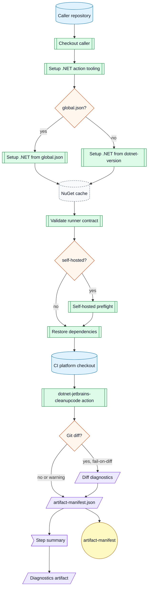

Preconditions:

- `solution` points to a solution or project in the caller repository.
- Lock files exist when `restore-locked-mode` is true.
- The selected runner can install or run the requested .NET SDK.
- The selected runner can install .NET 10 SDK for the action file script.
- Local tool restore requires `JetBrains.ReSharper.GlobalTools` in `.config/dotnet-tools.json`.
- `install-tool` requires network access to NuGet and should set `tool-version` for repeatability.

Side effects:

- Writes under `artifacts/jetbrains-cleanupcode`.
- Reads and writes NuGet dependency cache when `enable-cache` is true.
- Runs CleanupCode, which may modify workspace files before the Git diff gate.
- Fails when CleanupCode creates a Git diff and `fail-on-diff` is true.

Example:

```yaml
jobs:
  cleanup:
    name: CitizenId.slnx @ ${{ github.head_ref || github.ref_name }}
    uses: ArkanisCorporation/ci/.github/workflows/wf-setup-dotnet-jetbrains.yml@v1
    permissions:
      contents: read
    with:
      runs-on: ubuntu-latest
      runs-on-self-hosted: false
      dotnet-version: 10.0.x
      solution: CitizenId.slnx
      profile: "Built-in: Reformat & Apply Syntax Style"
      exclude: "**/*.razor;**/*.svg;**/*.md"
      enable-cache: true
```

## .NET Generated Code Workflow

`wf-setup-dotnet-generated-code.yml` checks out the caller repository.
It sets up .NET 10 action tooling, sets up the requested project SDK, restores local tools, restores dependencies, optionally builds the solution, runs generated-code commands, checks generated paths for tracked and untracked changes, writes diagnostics, writes a manifest, writes a summary, and uploads diagnostics.
It is based on CitizenId Wolverine generated handler verification.

Flow:

```mermaid
flowchart TD
  caller[("Caller repository")] --> checkout[[Checkout caller]]
  checkout --> tooling[[Setup .NET action tooling]]
  tooling --> sdk{global.json?}
  sdk -->|yes| global[[Setup .NET from global.json]]
  sdk -->|no| version[[Setup .NET from dotnet-version]]
  global --> cache[("NuGet cache")]
  version --> cache
  cache --> validate[[Validate runner contract]]
  validate --> preflight{self-hosted?}
  preflight -->|yes| sh[[Self-hosted preflight]]
  preflight -->|no| restoreTools[[Restore local .NET tools]]
  sh --> restoreTools
  restoreTools --> restore[[Restore dependencies]]
  restore --> build{build first?}
  build -->|yes| compile[[Build solution]]
  build -->|no| platform[("CI platform checkout")]
  compile --> platform
  platform --> verify[[dotnet-generated-code-diff action]]
  verify --> parallel{parallel commands?}
  parallel -->|yes| commands[[Run codegen commands in parallel]]
  parallel -->|no| serial[[Run codegen commands serially]]
  commands --> diff{Generated diff?}
  serial --> diff
  diff -->|yes, fail-on-diff| fail[/Diff diagnostics/]
  diff -->|no or warning| manifest[/artifact-manifest.json/]
  fail --> manifest
  manifest --> summary>Step summary]
  summary --> diagnostics[/Diagnostics artifact/]
  manifest --> outputs(("artifact-manifest"))
  classDef repo fill:#e0f2fe,stroke:#0369a1,color:#0f172a
  classDef action fill:#dcfce7,stroke:#15803d,color:#0f172a
  classDef decision fill:#fff7ed,stroke:#c2410c,color:#0f172a
  classDef artifact fill:#ede9fe,stroke:#6d28d9,color:#0f172a
  classDef output fill:#fef9c3,stroke:#a16207,color:#0f172a
  classDef external fill:#f8fafc,stroke:#475569,stroke-dasharray: 4 3,color:#0f172a
  class caller,platform repo
  class checkout,tooling,global,version,validate,sh,restoreTools,restore,compile,verify,commands,serial action
  class sdk,preflight,build,parallel,diff decision
  class fail,manifest,summary,diagnostics artifact
  class outputs output
  class cache external
```

Preconditions:

- `solution` points to a solution or project in the caller repository.
- `commands` contains one or more Bash commands that regenerate source.
- `generated-paths` contains repository-relative generated source paths.
- Lock files exist when `restore-locked-mode` is true.
- Parallel commands must be safe to run together when `run-commands-in-parallel` is true.

Side effects:

- Runs commands that may modify workspace files.
- Writes under `artifacts/generated-code`.
- Reads and writes NuGet dependency cache when `enable-cache` is true.
- Fails when generated paths change and `fail-on-diff` is true.

Example:

```yaml
jobs:
  wolverine:
    name: CitizenId.slnx @ ${{ github.head_ref || github.ref_name }}
    uses: ArkanisCorporation/ci/.github/workflows/wf-setup-dotnet-generated-code.yml@v1
    permissions:
      contents: read
    with:
      runs-on: ubuntu-latest
      runs-on-self-hosted: false
      dotnet-version: 10.0.x
      solution: CitizenId.slnx
      commands: |
        dotnet run --project src/CitizenId.Host.Discord/CitizenId.Host.Discord.csproj --no-build --no-launch-profile -- codegen write
        dotnet run --project src/CitizenId.Host.Web/CitizenId.Host.Web.csproj --no-build --no-launch-profile -- codegen write
      generated-paths: |
        src/CitizenId.Host.Discord/Internal/Generated/WolverineHandlers
        src/CitizenId.Host.Web/Internal/Generated/WolverineHandlers
      run-commands-in-parallel: true
```

## Node Setup Workflow

`wf-setup-node.yml` checks out the caller repository.
It sets up Node.js, prepares npm/pnpm/yarn, restores package-manager cache when enabled, installs dependencies with strict lockfile behavior, optionally runs lint/test/build scripts, writes metadata, writes a manifest, writes a summary, and uploads diagnostics.

Flow:


Preconditions:

- `working-directory` contains package.json.
- A lockfile exists for the selected package manager unless `cache-dependency-path` points at matching lockfiles.
- pnpm and yarn projects either set `package-manager-version` or include package.json `packageManager`.
- Lifecycle scripts are blocked in the generated install command unless `allow-lifecycle-scripts` is true.

Side effects:

- Writes under `artifacts/`.
- Writes Corepack shims and package-manager downloads under `RUNNER_TEMP`.
- Reads and writes package-manager cache when `enable-cache` is true.
- Uploads diagnostics with `if: always()` when `upload-diagnostics` is true.

## GitHub Actions Lint Workflow

`wf-lint-github-actions.yml` checks out the caller repository, sets up Python with pipx, records toolchain versions, and runs actionlint.
Use it to replace repository-local workflow lint jobs during migration.

Flow:

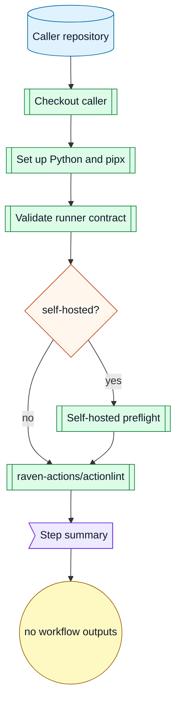

Preconditions:

- Caller workflows live under `.github/workflows`.
- The selected runner can run `actions/setup-python@v6` and install pipx.
- The selected runner can run `raven-actions/actionlint@v2`.

Side effects:

- Reads workflow YAML files.
- Records Python and pipx versions in diagnostics and the step summary.
- Writes a short step summary.

Example:

```yaml
jobs:
  lint_workflows:
    name: workflows @ ${{ github.head_ref || github.ref_name }}
    uses: ArkanisCorporation/ci/.github/workflows/wf-lint-github-actions.yml@v1
    permissions:
      contents: read
    with:
      runs-on: ubuntu-latest
      runs-on-self-hosted: false
```

## Semantic Release Verification Workflow

`wf-verify-release-semantic.yml` runs semantic-release with Node 24 in dry-run mode.
It rejects `@semantic-release/exec` unless `allow-exec-plugin` is explicitly true.
It uses read-only repository permissions and does not bind a GitHub environment.
Callers that use production-only semantic-release plugins should pass the same pinned plugins through `extra-plugins` so dry-runs validate the production release configuration.

Flow:


Preconditions:

- The caller repository contains valid semantic-release configuration.
- The selected runner can run Node.js and npm.

Side effects:

- Writes release diagnostics.
- Uploads diagnostic artifacts.
- Does not publish tags, releases, comments, packages, images, or deployments.

## Semantic Release Workflow

`wf-release-semantic.yml` runs semantic-release with Node 24 by default.
It rejects `@semantic-release/exec` unless `allow-exec-plugin` is explicitly true.
It binds the release job to `environment-name`.
Callers can pass pinned semantic-release plugins through `extra-plugins`, for example `semantic-release-major-tag@0.3.2` when repository config updates mutable major version tags such as `v1`.

Flow:

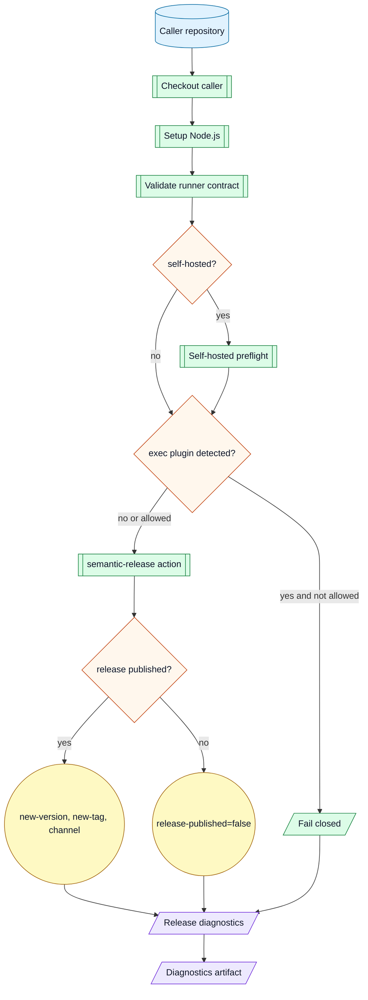

Preconditions:

- The caller grants release permissions.
- The caller passes or accepts the protected release environment name.
- The caller repository contains valid semantic-release configuration.
- Release branches are protected by caller policy.

Side effects:

- May create tags, mutable major tags, releases, changelog commits, comments, or release notes depending on repository semantic-release config.
- Uploads release diagnostics.

## Release Backpropagation Workflow

`wf-release-backpropagation.yml` creates a pull request from a release branch back to the default branch.
It can approve the PR using `PR_AUTOMATION_PAT` and enable auto-merge with GitHub CLI.
Use it only from trusted release workflows after semantic-release publishes a version.

Flow:

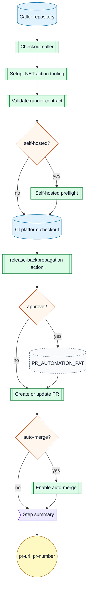

Preconditions:

- `new-version` is the semantic version that was published.
- `release-ref-name` is the release branch to merge back.
- `default-branch` is the target branch.
- `approve` requires `PR_AUTOMATION_PAT`.
- The selected runner has GitHub CLI and .NET 10 SDK.

Side effects:

- May create a pull request.
- May approve the pull request with the automation token.
- May enable auto-merge.

Example:

```yaml
jobs:
  release_backpropagation:
    name: ${{ needs.release.outputs.new-version }} @ ${{ github.event.repository.default_branch }}
    uses: ArkanisCorporation/ci/.github/workflows/wf-release-backpropagation.yml@v1
    permissions:
      contents: write
      pull-requests: write
    with:
      runs-on: ubuntu-latest
      runs-on-self-hosted: false
      new-version: ${{ needs.release.outputs.new-version }}
      release-ref-name: ${{ github.ref_name }}
      default-branch: ${{ github.event.repository.default_branch }}
      auto-merge: true
    secrets:
      PR_AUTOMATION_PAT: ${{ secrets.PR_AUTOMATION_PAT }}
```

## NuGet Publish Verification Workflow

`wf-verify-publish-nuget.yml` restores and packs one project without publishing it.
It uses read-only repository permissions and never requests NuGet secrets or OIDC.
It runs `dotnet-setversion` before packing by default so package assemblies and package metadata use the same release version.

Flow:

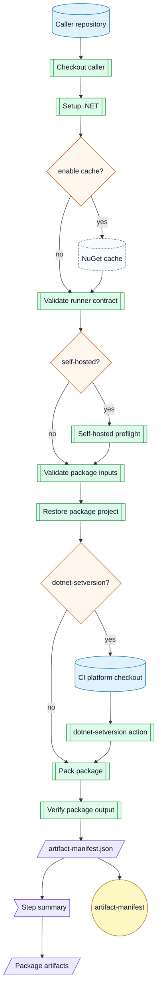

Preconditions:

- The project is packable.
- `version` is the semantic version to pack.
- `version` must be bare SemVer without a leading `v` when `dotnet-setversion` is true.

Side effects:

- Creates packages under `artifacts/nuget`.
- Reads and writes NuGet dependency cache when `enable-cache` is true.
- Checks out this CI platform repository under `.ci/arkanis-ci` when `dotnet-setversion` is true, then removes that checkout before pack runs.
- Modifies matched `.csproj` files before packing when `dotnet-setversion` is true.
- Does not publish packages.

## NuGet Publish Workflow

`wf-publish-nuget.yml` restores and packs one project.
It publishes packages from environment-gated jobs with NuGet Trusted Publishing by default.
It can use `NUGET_API_KEY` when `trusted-publishing` is false.
It runs `dotnet-setversion` before packing by default so package assemblies and package metadata use the same release version.
It exposes `include-symbols` and `include-source` as independent package options.
When `include-symbols` is true, workflows pass `--include-symbols` and `-p:SymbolPackageFormat=snupkg` to `dotnet pack`.

Flow:

```mermaid
flowchart TD
  caller[("Caller repository")] --> checkout[[Checkout caller]]
  checkout --> dotnet[[Setup .NET]]
  dotnet --> cache{enable cache?}
  cache -->|yes| nugetCache[("NuGet cache")]
  cache -->|no| validate[[Validate runner contract]]
  nugetCache --> validate
  validate --> preflight{self-hosted?}
  preflight -->|yes| sh[[Self-hosted preflight]]
  preflight -->|no| inputs[[Validate publish inputs]]
  sh --> inputs
  inputs --> restore[[Restore package project]]
  restore --> stamp{dotnet-setversion?}
  stamp -->|yes| platform[("CI platform checkout")]
  platform --> setversion[[dotnet-setversion action]]
  stamp -->|no| pack[[Pack package]]
  setversion --> pack
  pack --> verify[[Verify package output]]
  verify --> packageArtifact[/Package artifact/]
  packageArtifact --> auth{trusted publishing?}
  auth -->|yes| envOidc[["Environment-gated OIDC publish job"]]
  auth -->|no| envApi[["Environment-gated API-key publish job"]]
  envOidc --> oidc[[NuGet/login OIDC]]
  oidc --> trustedPush[[dotnet nuget push]]
  envApi --> apiKey[("NUGET_API_KEY")]
  apiKey --> keyPush[[dotnet nuget push]]
  trustedPush --> manifest[/artifact-manifest.json/]
  keyPush --> manifest
  manifest --> summary>Step summary]
  summary --> outputs(("artifact-manifest"))
  classDef repo fill:#e0f2fe,stroke:#0369a1,color:#0f172a
  classDef action fill:#dcfce7,stroke:#15803d,color:#0f172a
  classDef decision fill:#fff7ed,stroke:#c2410c,color:#0f172a
  classDef artifact fill:#ede9fe,stroke:#6d28d9,color:#0f172a
  classDef output fill:#fef9c3,stroke:#a16207,color:#0f172a
  classDef external fill:#f8fafc,stroke:#475569,stroke-dasharray: 4 3,color:#0f172a
  class caller,platform repo
  class checkout,dotnet,validate,sh,inputs,restore,setversion,pack,verify,envOidc,envApi,oidc,trustedPush,keyPush action
  class cache,preflight,stamp,auth decision
  class packageArtifact,manifest,summary artifact
  class outputs output
  class nugetCache,apiKey external
```

Preconditions:

- The project is packable.
- `version` is the semantic version to pack.
- `version` must be bare SemVer without a leading `v` when `dotnet-setversion` is true.
- Trusted Publishing requires a nuget.org policy that matches the workflow requesting the OIDC token.
- API-key fallback requires the `NUGET_API_KEY` secret.
- Production publication binds the publish job to `environment-name`.

Side effects:

- Creates packages under `artifacts/nuget`.
- Reads and writes NuGet dependency cache when `enable-cache` is true.
- Checks out this CI platform repository under `.ci/arkanis-ci` when `dotnet-setversion` is true, then removes that checkout before pack runs.
- Modifies matched `.csproj` files before packing when `dotnet-setversion` is true.
- Publishes packages from the selected environment-gated publish job.

## NuGet Trusted Publishing Caller Pattern

Use a caller-owned protected publish job when nuget.org policy ownership must match the consumer repository workflow file.
Call `wf-verify-publish-nuget.yml` first to produce package artifacts without secrets.
Then download the package artifact in the caller repository publish job, run `NuGet/login`, and push with the returned API key in a subsequent step in the same job.
Do not pass the temporary API key through job outputs, workflow outputs, artifacts, caches, or summaries.

Example:

```yaml
jobs:
  verify_nuget:
    uses: ArkanisCorporation/ci/.github/workflows/wf-verify-publish-nuget.yml@v1
    permissions:
      contents: read
    with:
      project: src/Library/Library.csproj
      version: ${{ needs.release.outputs.new-version }}

  publish_nuget:
    needs: verify_nuget
    runs-on: ubuntu-latest
    environment: nuget
    permissions:
      contents: read
      id-token: write
    steps:
      - name: Download verified package
        uses: actions/download-artifact@v7
        with:
          pattern: '*-nuget-verify-*'
          path: artifacts
          merge-multiple: true
      - name: NuGet login
        id: nuget-login
        uses: NuGet/login@v1
        with:
          user: arkanis
      - name: Push packages
        run: |
          for package in artifacts/nuget/*.nupkg; do
            dotnet nuget push "$package" \
              --api-key "${{ steps.nuget-login.outputs.NUGET_API_KEY }}" \
              --source https://api.nuget.org/v3/index.json \
              --skip-duplicate
          done
```

## .NET Container Publish Verification Workflow

`wf-verify-publish-container-dotnet.yml` stamps .NET project versions, then builds with Docker Buildx without pushing.
It uses read-only repository permissions.
It disables SBOM and provenance emission so verification does not need OIDC or attestation permissions.

Flow:

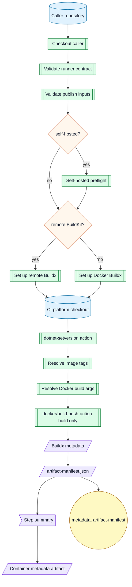

Preconditions:

- The runner can run Docker Buildx or reach the configured remote BuildKit endpoint.
- `version` is a required bare SemVer value without a leading `v`.
- `version-working-directory` contains .NET project files unless `version-recursive` is false and `version-project` is set.

Side effects:

- Builds container layers without pushing them.
- Checks out this CI platform repository under `.ci/arkanis-ci`, then removes that checkout before Docker Buildx runs.
- Modifies matched `.csproj` files before Docker Buildx runs.
- Passes Docker build args to BuildKit; never put secrets in `build-args`.

## .NET Container Publish Workflow

`wf-publish-container-dotnet.yml` stamps .NET project versions, then uses Docker Buildx.
It supports GitHub-hosted Docker, self-hosted Docker, and remote BuildKit endpoints.
It always runs the `dotnet-setversion` composite action before Docker Buildx.
It appends a non-secret `VERSION=<version>` Docker build argument unless `build-args` already defines `VERSION`.
`version` is always the bare semantic version, such as `1.2.3`.
`version-tag` is only for image tags and may use the release tag form, such as `v1.2.3`.
`version-channel` adds both the raw channel tag and, by default, a `<channel>-latest` tag.
Use `extra-tags` for additional mutable tags such as `latest`.

Requirements:

| Requirement | Permission | Mode |
|---|---|---|
| Caller repository checkout and platform action checkout. | `contents: read` | always |
| Registry write token for pushed images. | `packages: write` for GHCR, or registry-specific write scope | always |
| Provenance metadata and attestations. | `id-token: write`<br>`attestations: write` | `provenance` or `sbom` |

Flow:

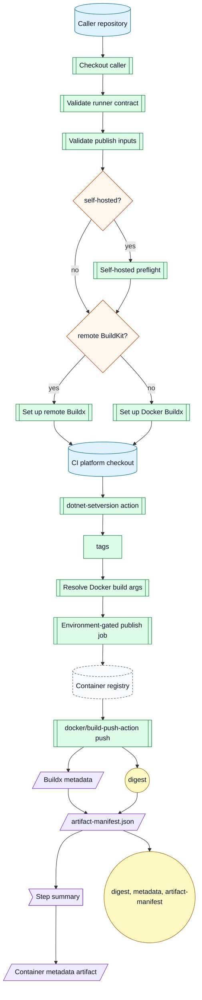

Preconditions:

- The runner can run Docker Buildx or reach the configured remote BuildKit endpoint.
- Registry credentials are available.
- Production publication binds the publish job to `environment-name`.
- `version` is a required bare SemVer value without a leading `v`.
- `version-working-directory` contains .NET project files unless `version-recursive` is false and `version-project` is set.
- Version stamping requires Bash, network access to restore actions/tool packages, and called-workflow `job` metadata support from reusable workflows.
- `extra-tags` accepts newline-delimited bare tag names or full image references.

Side effects:

- Builds container layers before pushing them.
- Pushes registry tags.
- May create mutable channel tags, channel-latest tags, and extra tags when configured.
- Checks out this CI platform repository under `.ci/arkanis-ci`, then removes that checkout before Docker Buildx runs.
- Modifies matched `.csproj` files before Docker Buildx runs.
- Passes Docker build args to BuildKit; never put secrets in `build-args`.
- Emits a digest output for downstream deploys.

Example:

```yaml
jobs:
  publish_web:
    name: ${{ needs.release.outputs.new-tag || needs.release.outputs.new-version }} @ ghcr.io
    uses: ArkanisCorporation/ci/.github/workflows/wf-publish-container-dotnet.yml@v1
    permissions:
      contents: read
      packages: write
      id-token: write
      attestations: write
    with:
      runs-on: ubuntu-latest
      runs-on-self-hosted: false
      image: ghcr.io/arkaniscorporation/example-web
      context: .
      dockerfile: src/Web/Dockerfile
      version: ${{ needs.release.outputs.new-version }}
      version-tag: ${{ needs.release.outputs.new-tag }}
      version-channel: ${{ needs.release.outputs.new-channel }}
      extra-tags: |
        latest
      environment-name: container
    secrets:
      REGISTRY_TOKEN: ${{ secrets.GITHUB_TOKEN }}
```

## Aspire Kubernetes Deploy Verification Workflow

`wf-verify-deploy-k8s-aspire.yml` validates Aspire deployment inputs and tool availability without applying cluster changes.
It does not bind a GitHub environment or read `KUBE_CONFIG`.

Flow:

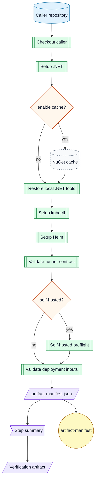

Preconditions:

- The AppHost project exists.
- The target namespace is a valid Kubernetes namespace.
- The selected runner can install .NET, kubectl, and Helm.

Side effects:

- Reads and writes NuGet dependency cache when `enable-cache` is true.
- Writes a verification manifest.
- Does not configure kube credentials, create namespaces, deploy, or use GitHub environments.

## Aspire Kubernetes Deploy Workflow

`wf-deploy-k8s-aspire.yml` deploys with `dotnet tool run aspire -- deploy`.
It accepts an optional `KUBE_CONFIG` secret.
If `KUBE_CONFIG` is omitted, the runner must already have a valid kube context.

Flow:

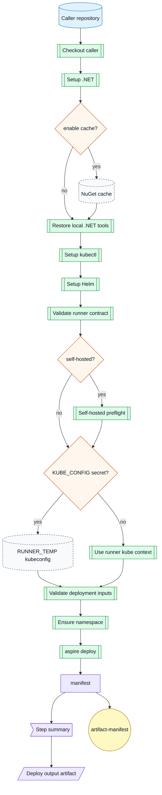

Preconditions:

- The runner can reach the Kubernetes API.
- The AppHost project exists.
- The target namespace is a valid Kubernetes namespace.
- Production deployment binds the deploy job to `environment-name`.

Side effects:

- Creates the namespace when missing.
- Reads and writes NuGet dependency cache when `enable-cache` is true.
- Applies deployment changes.
- Writes deploy output under `output-path/environment-name`.

## Platform Selftest Workflow

`wf-platform-selftest.yml` validates this CI platform repository.
It runs actionlint 1.7.12, runs the static workflow contract validator, checks generated workflow input docs, and writes a step summary.
It is callable as a reusable workflow and directly runnable with `workflow_dispatch` for local `act` smoke tests.

Flow:

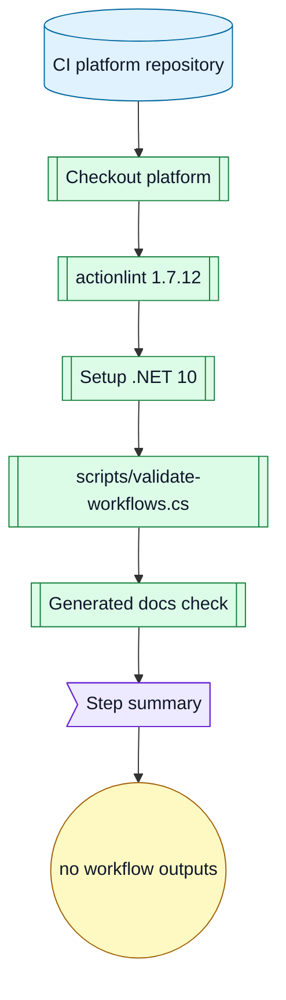

Preconditions:

- The repository contains `.github/workflows`, `.github/actions`, `schemas/workflow-inputs`, policy files, fixtures, and docs.
- The selected runner can install or run .NET 10.
- The selected runner can run `raven-actions/actionlint@v2` with actionlint `1.7.12`.
- Local validator runs still use a system `actionlint` when available.

Side effects:

- Reads workflow, action, schema, fixture, policy, and doc files.
- Writes a step summary.
- Does not publish, deploy, or request secrets.

Example:

```yaml
jobs:
  selftest:
    name: platform @ ${{ github.head_ref || github.ref_name }}
    uses: ArkanisCorporation/ci/.github/workflows/wf-platform-selftest.yml@v1
    permissions:
      contents: read
    with:
      runs-on: ubuntu-latest
      runs-on-self-hosted: false
```
