# Workflow Catalog

Audience: consumers and platform maintainers.

## Public Workflows

| Workflow | Purpose | Trust zone |
|---|---|---|
| `wf-dotnet-format.yml` | Verify optional `dotnet format` and mandatory JetBrains CleanupCode without running tests. | untrusted or trusted-build |
| `wf-dotnet-test.yml` | Build, test, collect coverage, metadata, and diagnostics for .NET repositories. | untrusted or trusted-build |
| `wf-setup-dotnet-generated-code.yml` | Verify committed .NET generated source. | untrusted or trusted-build |
| `wf-node-lint.yml` | Run one Node lint script or command. | untrusted or trusted-build |
| `wf-node-test.yml` | Run one Node test script or command. | untrusted or trusted-build |
| `wf-node-build.yml` | Run one Node build script or command. | untrusted or trusted-build |
| `wf-lint-github-actions.yml` | Lint caller GitHub Actions workflows. | untrusted or trusted-build |
| `wf-verify-release-semantic.yml` | Verify semantic-release metadata without publishing. | trusted-build |
| `wf-release-semantic.yml` | Publish semantic-release metadata without `@semantic-release/exec`. | publish |
| `wf-release-backpropagation.yml` | Create release branch backpropagation PRs. | publish |
| `wf-verify-publish-nuget.yml` | Pack one NuGet project without publishing. | untrusted or trusted-build |
| `wf-publish-nuget.yml` | Pack and publish one NuGet project. | publish |
| `wf-verify-publish-container-dotnet.yml` | Stamp and build one .NET OCI image without pushing. | untrusted or trusted-build |
| `wf-publish-container-dotnet.yml` | Stamp and publish one .NET OCI image. | publish |
| `wf-verify-deploy-k8s-aspire.yml` | Verify Aspire Kubernetes deployment inputs without applying changes. | untrusted or trusted-build |
| `wf-deploy-k8s-aspire.yml` | Deploy an Aspire AppHost to Kubernetes. | deploy |
| `wf-platform-selftest.yml` | Validate platform workflow contracts. | trusted-build |

## Public Workflow Permissions

| Workflow | Minimum caller permissions | Main outputs |
|---|---|---|
| `wf-dotnet-format.yml` | `contents: read` | format diagnostics, CleanupCode diff diagnostics, metadata, manifest |
| `wf-dotnet-test.yml` | `contents: read`<br>`pull-requests: write` only for coverage comments | test results, coverage files, binlog, metadata, manifest |
| `wf-setup-dotnet-generated-code.yml` | `contents: read` | command logs, changed-file list, diff stat, diff preview, manifest |
| `wf-node-lint.yml` | `contents: read` | install and lint logs, metadata, manifest |
| `wf-node-test.yml` | `contents: read` | install and test logs, metadata, manifest |
| `wf-node-build.yml` | `contents: read` | install and build logs, metadata, manifest |
| `wf-lint-github-actions.yml` | `contents: read` | step summary |
| `wf-verify-release-semantic.yml` | `contents: write` | release diagnostics and predicted release outputs |
| `wf-release-semantic.yml` | `contents: write`<br>`issues: write`<br>`pull-requests: write` | release diagnostics and release outputs |
| `wf-release-backpropagation.yml` | `contents: write`<br>`pull-requests: write` | pull request summary |
| `wf-verify-publish-nuget.yml` | `contents: read` | `.nupkg`, `.snupkg`, manifest |
| `wf-publish-nuget.yml` | `contents: read` for pack and API-key publish<br>`id-token: write` only for Trusted Publishing job | `.nupkg`, `.snupkg`, manifest |
| `wf-verify-publish-container-dotnet.yml` | `contents: read` | Buildx metadata, manifest |
| `wf-publish-container-dotnet.yml` | `contents: read`<br>`packages: write` when pushing to GHCR<br>`id-token: write` for provenance<br>`attestations: write` for attestations | digest, Buildx metadata, manifest |
| `wf-verify-deploy-k8s-aspire.yml` | `contents: read` | verification manifest |
| `wf-deploy-k8s-aspire.yml` | `contents: read`<br>`packages: write` for GHCR login during deployment | deploy output, manifest |
| `wf-platform-selftest.yml` | `contents: read` | step summary |

## Repository Workflows

| Workflow | Purpose | Permissions |
|---|---|---|
| `release.yml` | Run platform selftests and fixture dogfood jobs for pull requests, main pushes, and manual dispatches before verification or publication. | PR verification uses `contents: write` for semantic-release dry-run tag push checks.<br>Release publication uses `contents: write`, `issues: write`, and `pull-requests: write`. |

`release.yml` passes `vars.RUNNER_DEFAULT || 'daedalus'` and `runs-on-self-hosted: true` to every repository-local reusable workflow call.

## Common Inputs

| Input | Meaning |
|---|---|
| `runs-on` | Single runner label used when `runs-on-json` is empty. |
| `runs-on-json` | JSON array passed to `runs-on`, overriding `runs-on` when set. |
| `runs-on-self-hosted` | True when the effective runner selection targets self-hosted runners. |
| `enable-cache` | Enables dependency cache where the workflow uses `runs-on/cache`. |
| `timeout-minutes` | Job timeout. |
| `artifact-retention-days` | Diagnostic or output artifact retention. |

Use `runs-on` for a single GitHub-hosted label such as `ubuntu-latest`.
Use `runs-on-json` for self-hosted or multi-label runner selection.
Use `runs-on-self-hosted` to let workflows gate hosted-only and self-hosted-only assumptions.
Set `enable-cache` to false for cold-restore validation, cache incident isolation, or runners without cache service access.

## Platform Action Source

Reusable workflows that need this platform repository's composite actions check out the called workflow source under `.ci/arkanis-ci`.
Those checkouts read `workflow_repository` and `workflow_sha` from the `job` context through `fromJSON(toJSON(job))` so GitHub receives the called workflow metadata.
`fromJSON(toJSON(job))` is only there because our pinned actionlint:1.7.12 does not know the newer documented job.workflow_ref / job.workflow_sha fields.
Do not use `github.workflow_ref` or `github.workflow_sha` for that source resolution because the `github` context is scoped to the caller repository in reusable workflows.
Keep `.ci/arkanis-ci` in place for the rest of the job so local composite actions remain available when GitHub Actions runs post-job cleanup.

## Schema-Backed Workflow Inputs

The following tables are generated from `schemas/workflow-inputs/*.schema.json`.
Run `dotnet run --file scripts/generate-docs.cs` after schema changes.

<!-- generated:workflow-inputs:start -->
### wf-deploy-k8s-aspire.yml

Schema: `schemas/workflow-inputs/wf-deploy-k8s-aspire.schema.json`.

| Input | Type | Required | Default | Details |
|---|---|---|---|---|
| `runs-on` | string | no | `"ubuntu-latest"` | n/a |
| `runs-on-json` | string | no | `""` | n/a |
| `runs-on-self-hosted` | boolean | no | `false` | n/a |
| `environment-name` | string | yes | none | n/a |
| `aspire-environment` | string | yes | none | n/a |
| `kubernetes-namespace` | string | yes | none | n/a |
| `apphost-project` | string | yes | none | n/a |
| `output-path` | string | no | `"artifacts/k8s"` | n/a |
| `image-tag` | string | no | `""` | n/a |
| `dotnet-version` | string | no | `"10.0.x"` | n/a |
| `global-json-file` | string | no | `""` | n/a |
| `enable-cache` | boolean | no | `true` | n/a |
| `kubectl-version` | string | no | `"v1.36.2"` | n/a |
| `helm-version` | string | no | `"v4.2.2"` | n/a |
| `timeout-minutes` | integer | no | `45` | Minimum: 1 |
| `artifact-retention-days` | integer | no | `30` | Minimum: 1<br>Maximum: 90 |

Outputs: schema does not define workflow outputs.

### wf-dotnet-format.yml

Schema: `schemas/workflow-inputs/wf-dotnet-format.schema.json`.

| Input | Type | Required | Default | Details |
|---|---|---|---|---|
| `runs-on` | string | no | `"ubuntu-latest"` | n/a |
| `runs-on-json` | string | no | `""` | n/a |
| `runs-on-self-hosted` | boolean | no | `false` | n/a |
| `dotnet-version` | string | no | `"10.0.x"` | n/a |
| `global-json-file` | string | no | `""` | n/a |
| `solution` | string | yes | none | n/a |
| `working-directory` | string | no | `"."` | n/a |
| `restore-locked-mode` | boolean | no | `true` | n/a |
| `run-dotnet-format` | boolean | no | `true` | n/a |
| `enable-cache` | boolean | no | `true` | n/a |
| `profile` | string | no | `"Built-in: Reformat & Apply Syntax Style"` | n/a |
| `include` | string | no | `""` | n/a |
| `exclude` | string | no | `"**/*.razor;**/*.svg;**/*.md"` | n/a |
| `no-updates` | boolean | no | `true` | n/a |
| `restore-tools` | boolean | no | `true` | n/a |
| `install-tool` | boolean | no | `false` | n/a |
| `tool-version` | string | no | `""` | n/a |
| `fail-on-diff` | boolean | no | `true` | n/a |
| `remediation-message` | string | no | `"Run \`dotnet husky run --name dotnet-cleanupcode\` locally and commit the resulting changes."` | n/a |
| `artifact-retention-days` | integer | no | `14` | Minimum: 1<br>Maximum: 90 |
| `timeout-minutes` | integer | no | `20` | Minimum: 1 |

Outputs: schema does not define workflow outputs.

### wf-dotnet-test.yml

Schema: `schemas/workflow-inputs/wf-dotnet-test.schema.json`.

| Input | Type | Required | Default | Details |
|---|---|---|---|---|
| `runs-on` | string | no | `"ubuntu-latest"` | n/a |
| `runs-on-json` | string | no | `""` | n/a |
| `runs-on-self-hosted` | boolean | no | `false` | n/a |
| `dotnet-version` | string | no | `"10.0.x"` | n/a |
| `global-json-file` | string | no | `""` | n/a |
| `solution` | string | yes | none | n/a |
| `configuration` | string | no | `"Release"` | n/a |
| `restore-locked-mode` | boolean | no | `true` | n/a |
| `enable-cache` | boolean | no | `true` | n/a |
| `test-filter` | string | no | `""` | n/a |
| `coverage` | boolean | no | `true` | n/a |
| `coverage-report` | boolean | no | `true` | n/a |
| `coverage-pr-comment` | boolean | no | `true` | n/a |
| `upload-test-results` | boolean | no | `false` | n/a |
| `upload-coverage` | boolean | no | `false` | n/a |
| `coverage-reporttypes` | string | no | `"HtmlInline;Cobertura;MarkdownSummaryGithub;TextSummary"` | n/a |
| `coverage-assemblyfilters` | string | no | `"+*;-*.UnitTests;-*.IntegrationTests"` | n/a |
| `coverage-report-custom-settings` | string | no | `""` | n/a |
| `coverage-report-tool-version` | string | no | `"5.5.10"` | n/a |
| `artifact-retention-days` | integer | no | `7` | Minimum: 1<br>Maximum: 90 |
| `timeout-minutes` | integer | no | `30` | Minimum: 1 |

Outputs: schema does not define workflow outputs.

### wf-lint-github-actions.yml

Schema: `schemas/workflow-inputs/wf-lint-github-actions.schema.json`.

| Input | Type | Required | Default | Details |
|---|---|---|---|---|
| `runs-on` | string | no | `"ubuntu-latest"` | n/a |
| `runs-on-json` | string | no | `""` | n/a |
| `runs-on-self-hosted` | boolean | no | `false` | n/a |
| `enable-cache` | boolean | no | `true` | Enable the actionlint binary cache used by raven-actions/actionlint. |
| `timeout-minutes` | integer | no | `10` | Minimum: 1 |

Outputs: schema does not define workflow outputs.

### wf-node-build.yml

Schema: `schemas/workflow-inputs/wf-node-build.schema.json`.

| Input | Type | Required | Default | Details |
|---|---|---|---|---|
| `runs-on` | string | no | `"ubuntu-latest"` | n/a |
| `runs-on-json` | string | no | `""` | n/a |
| `runs-on-self-hosted` | boolean | no | `false` | n/a |
| `node-version` | string | no | `"24.x"` | n/a |
| `package-manager` | string | no | `"pnpm"` | Allowed: "npm", "pnpm", "yarn" |
| `package-manager-version` | string | no | `""` | n/a |
| `working-directory` | string | no | `"."` | n/a |
| `cache-dependency-path` | string | no | `""` | n/a |
| `enable-cache` | boolean | no | `true` | n/a |
| `run-install` | boolean | no | `true` | n/a |
| `install-command` | string | no | `""` | n/a |
| `allow-lifecycle-scripts` | boolean | no | `false` | n/a |
| `build-script` | string | no | `"build"` | n/a |
| `build-command` | string | no | `""` | n/a |
| `artifact-retention-days` | integer | no | `14` | Minimum: 1<br>Maximum: 90 |
| `upload-diagnostics` | boolean | no | `true` | n/a |
| `timeout-minutes` | integer | no | `20` | Minimum: 1 |

Outputs: schema does not define workflow outputs.

### wf-node-lint.yml

Schema: `schemas/workflow-inputs/wf-node-lint.schema.json`.

| Input | Type | Required | Default | Details |
|---|---|---|---|---|
| `runs-on` | string | no | `"ubuntu-latest"` | n/a |
| `runs-on-json` | string | no | `""` | n/a |
| `runs-on-self-hosted` | boolean | no | `false` | n/a |
| `node-version` | string | no | `"24.x"` | n/a |
| `package-manager` | string | no | `"pnpm"` | Allowed: "npm", "pnpm", "yarn" |
| `package-manager-version` | string | no | `""` | n/a |
| `working-directory` | string | no | `"."` | n/a |
| `cache-dependency-path` | string | no | `""` | n/a |
| `enable-cache` | boolean | no | `true` | n/a |
| `run-install` | boolean | no | `true` | n/a |
| `install-command` | string | no | `""` | n/a |
| `allow-lifecycle-scripts` | boolean | no | `false` | n/a |
| `lint-script` | string | no | `"lint"` | n/a |
| `lint-command` | string | no | `""` | n/a |
| `artifact-retention-days` | integer | no | `14` | Minimum: 1<br>Maximum: 90 |
| `upload-diagnostics` | boolean | no | `true` | n/a |
| `timeout-minutes` | integer | no | `20` | Minimum: 1 |

Outputs: schema does not define workflow outputs.

### wf-node-test.yml

Schema: `schemas/workflow-inputs/wf-node-test.schema.json`.

| Input | Type | Required | Default | Details |
|---|---|---|---|---|
| `runs-on` | string | no | `"ubuntu-latest"` | n/a |
| `runs-on-json` | string | no | `""` | n/a |
| `runs-on-self-hosted` | boolean | no | `false` | n/a |
| `node-version` | string | no | `"24.x"` | n/a |
| `package-manager` | string | no | `"pnpm"` | Allowed: "npm", "pnpm", "yarn" |
| `package-manager-version` | string | no | `""` | n/a |
| `working-directory` | string | no | `"."` | n/a |
| `cache-dependency-path` | string | no | `""` | n/a |
| `enable-cache` | boolean | no | `true` | n/a |
| `run-install` | boolean | no | `true` | n/a |
| `install-command` | string | no | `""` | n/a |
| `allow-lifecycle-scripts` | boolean | no | `false` | n/a |
| `test-script` | string | no | `"test"` | n/a |
| `test-command` | string | no | `""` | n/a |
| `artifact-retention-days` | integer | no | `14` | Minimum: 1<br>Maximum: 90 |
| `upload-diagnostics` | boolean | no | `true` | n/a |
| `timeout-minutes` | integer | no | `20` | Minimum: 1 |

Outputs: schema does not define workflow outputs.

### wf-platform-selftest.yml

Schema: `schemas/workflow-inputs/wf-platform-selftest.schema.json`.

| Input | Type | Required | Default | Details |
|---|---|---|---|---|
| `runs-on` | string | no | `"ubuntu-latest"` | n/a |
| `runs-on-json` | string | no | `""` | n/a |
| `runs-on-self-hosted` | boolean | no | `false` | n/a |

Outputs: schema does not define workflow outputs.

### wf-publish-container-dotnet.yml

Schema: `schemas/workflow-inputs/wf-publish-container-dotnet.schema.json`.

| Input | Type | Required | Default | Details |
|---|---|---|---|---|
| `runs-on` | string | no | `"ubuntu-latest"` | n/a |
| `runs-on-json` | string | no | `""` | n/a |
| `runs-on-self-hosted` | boolean | no | `false` | n/a |
| `environment-name` | string | no | `"container"` | n/a |
| `image` | string | yes | none | n/a |
| `context` | string | no | `"."` | n/a |
| `dockerfile` | string | no | `"Dockerfile"` | n/a |
| `platforms` | string | no | `"linux/amd64"` | n/a |
| `version` | string | yes | none | Bare semantic version without leading v. |
| `version-tag` | string | no | `""` | n/a |
| `version-channel` | string | no | `""` | n/a |
| `channel-latest` | boolean | no | `true` | n/a |
| `extra-tags` | string | no | `""` | n/a |
| `registry` | string | no | `"ghcr.io"` | n/a |
| `registry-username` | string | no | `""` | n/a |
| `buildkit-endpoint` | string | no | `""` | n/a |
| `build-args` | string | no | `""` | n/a |
| `nuget-build-secret` | boolean | no | `false` | Mount a generated NuGet.Config as a BuildKit secret for Dockerfile restore. |
| `sdk-version` | string | no | `"10.0.x"` | n/a |
| `global-json-file` | string | no | `""` | n/a |
| `version-working-directory` | string | no | `"."` | n/a |
| `version-recursive` | boolean | no | `true` | n/a |
| `version-project` | string | no | `""` | n/a |
| `version-tool-version` | string | no | `"4.0.0"` | n/a |
| `enable-cache` | boolean | no | `true` | Use a generated GitHub Actions BuildKit cache when cache-from and cache-to are empty. |
| `cache-from` | string | no | `""` | Docker Buildx cache-from value. Overrides the generated GitHub Actions cache when set. |
| `cache-to` | string | no | `""` | Docker Buildx cache-to value. Overrides the generated GitHub Actions cache when set. |
| `sbom` | string | no | `"true"` | n/a |
| `provenance` | string | no | `"mode=max"` | n/a |
| `labels` | string | no | `""` | n/a |
| `timeout-minutes` | integer | no | `45` | Minimum: 1 |
| `artifact-retention-days` | integer | no | `30` | Minimum: 1<br>Maximum: 90 |

Outputs: schema does not define workflow outputs.

### wf-publish-nuget.yml

Schema: `schemas/workflow-inputs/wf-publish-nuget.schema.json`.

| Input | Type | Required | Default | Details |
|---|---|---|---|---|
| `runs-on` | string | no | `"ubuntu-latest"` | n/a |
| `runs-on-json` | string | no | `""` | n/a |
| `runs-on-self-hosted` | boolean | no | `false` | n/a |
| `environment-name` | string | no | `"nuget"` | n/a |
| `project` | string | yes | none | n/a |
| `version` | string | yes | none | n/a |
| `dotnet-version` | string | no | `"10.0.x"` | n/a |
| `global-json-file` | string | no | `""` | n/a |
| `configuration` | string | no | `"Release"` | n/a |
| `enable-cache` | boolean | no | `true` | n/a |
| `source` | string | no | `"https://api.nuget.org/v3/index.json"` | n/a |
| `trusted-publishing` | boolean | no | `true` | n/a |
| `nuget-user` | string | no | `""` | NuGet profile or organization name used by NuGet/login. Falls back to the caller NUGET_USER secret, then configuration variable, when empty. |
| `skip-duplicate` | boolean | no | `true` | n/a |
| `include-symbols` | boolean | no | `true` | n/a |
| `include-source` | boolean | no | `true` | n/a |
| `dotnet-setversion` | boolean | no | `true` | n/a |
| `dotnet-setversion-working-directory` | string | no | `"."` | n/a |
| `dotnet-setversion-recursive` | boolean | no | `true` | n/a |
| `dotnet-setversion-project` | string | no | `""` | n/a |
| `dotnet-setversion-tool-version` | string | no | `"4.0.0"` | n/a |
| `timeout-minutes` | integer | no | `30` | Minimum: 1 |
| `artifact-retention-days` | integer | no | `30` | Minimum: 1<br>Maximum: 90 |

Outputs: schema does not define workflow outputs.

### wf-release-backpropagation.yml

Schema: `schemas/workflow-inputs/wf-release-backpropagation.schema.json`.

| Input | Type | Required | Default | Details |
|---|---|---|---|---|
| `runs-on` | string | no | `"ubuntu-latest"` | n/a |
| `runs-on-json` | string | no | `""` | n/a |
| `runs-on-self-hosted` | boolean | no | `false` | n/a |
| `environment-name` | string | no | `"release-backpropagation"` | GitHub environment that provides PR_AUTOMATION_PAT for optional PR approval. |
| `new-version` | string | yes | none | n/a |
| `release-ref-name` | string | yes | none | n/a |
| `default-branch` | string | yes | none | n/a |
| `labels` | string | no | `"ci\nautomated\n"` | n/a |
| `auto-merge` | boolean | no | `true` | n/a |
| `merge-method` | string | no | `"merge"` | Allowed: "merge", "squash", "rebase" |
| `approve` | boolean | no | `true` | n/a |
| `timeout-minutes` | integer | no | `10` | Minimum: 1 |

Outputs: schema does not define workflow outputs.

### wf-release-semantic.yml

Schema: `schemas/workflow-inputs/wf-release-semantic.schema.json`.

| Input | Type | Required | Default | Details |
|---|---|---|---|---|
| `runs-on` | string | no | `"ubuntu-latest"` | n/a |
| `runs-on-json` | string | no | `""` | n/a |
| `runs-on-self-hosted` | boolean | no | `false` | n/a |
| `environment-name` | string | no | `"release"` | n/a |
| `node-version` | string | no | `"24.x"` | n/a |
| `semantic-release-version` | string | no | `"25.0.5"` | n/a |
| `extra-plugins` | string | no | `"@semantic-release/changelog@6.0.3"` | n/a |
| `allow-exec-plugin` | boolean | no | `false` | n/a |
| `timeout-minutes` | integer | no | `30` | Minimum: 1 |
| `artifact-retention-days` | integer | no | `14` | Minimum: 1<br>Maximum: 90 |

Outputs: schema does not define workflow outputs.

### wf-setup-dotnet-generated-code.yml

Schema: `schemas/workflow-inputs/wf-setup-dotnet-generated-code.schema.json`.

| Input | Type | Required | Default | Details |
|---|---|---|---|---|
| `runs-on` | string | no | `"ubuntu-latest"` | n/a |
| `runs-on-json` | string | no | `""` | n/a |
| `runs-on-self-hosted` | boolean | no | `false` | n/a |
| `dotnet-version` | string | no | `"10.0.x"` | n/a |
| `global-json-file` | string | no | `""` | n/a |
| `solution` | string | yes | none | n/a |
| `configuration` | string | no | `"Release"` | n/a |
| `restore-locked-mode` | boolean | no | `true` | n/a |
| `enable-cache` | boolean | no | `true` | n/a |
| `build-before-commands` | boolean | no | `true` | n/a |
| `commands` | string | yes | none | n/a |
| `generated-paths` | string | yes | none | n/a |
| `run-commands-in-parallel` | boolean | no | `true` | n/a |
| `fail-on-diff` | boolean | no | `true` | n/a |
| `remediation-message` | string | no | `"Regenerate generated source locally and commit the resulting changes."` | n/a |
| `timeout-minutes` | integer | no | `20` | Minimum: 1 |
| `artifact-retention-days` | integer | no | `14` | Minimum: 1<br>Maximum: 90 |

Outputs: schema does not define workflow outputs.

### wf-verify-deploy-k8s-aspire.yml

Schema: `schemas/workflow-inputs/wf-verify-deploy-k8s-aspire.schema.json`.

| Input | Type | Required | Default | Details |
|---|---|---|---|---|
| `runs-on` | string | no | `"ubuntu-latest"` | n/a |
| `runs-on-json` | string | no | `""` | n/a |
| `runs-on-self-hosted` | boolean | no | `false` | n/a |
| `aspire-environment` | string | yes | none | n/a |
| `kubernetes-namespace` | string | yes | none | n/a |
| `apphost-project` | string | yes | none | n/a |
| `output-path` | string | no | `"artifacts/k8s"` | n/a |
| `image-tag` | string | no | `""` | n/a |
| `dotnet-version` | string | no | `"10.0.x"` | n/a |
| `global-json-file` | string | no | `""` | n/a |
| `enable-cache` | boolean | no | `true` | n/a |
| `kubectl-version` | string | no | `"v1.36.2"` | n/a |
| `helm-version` | string | no | `"v4.2.2"` | n/a |
| `timeout-minutes` | integer | no | `45` | Minimum: 1 |
| `artifact-retention-days` | integer | no | `30` | Minimum: 1<br>Maximum: 90 |

Outputs: schema does not define workflow outputs.

### wf-verify-publish-container-dotnet.yml

Schema: `schemas/workflow-inputs/wf-verify-publish-container-dotnet.schema.json`.

| Input | Type | Required | Default | Details |
|---|---|---|---|---|
| `runs-on` | string | no | `"ubuntu-latest"` | n/a |
| `runs-on-json` | string | no | `""` | n/a |
| `runs-on-self-hosted` | boolean | no | `false` | n/a |
| `image` | string | yes | none | n/a |
| `context` | string | no | `"."` | n/a |
| `dockerfile` | string | no | `"Dockerfile"` | n/a |
| `platforms` | string | no | `"linux/amd64"` | n/a |
| `version` | string | yes | none | Bare semantic version without leading v. |
| `version-tag` | string | no | `""` | n/a |
| `version-channel` | string | no | `""` | n/a |
| `channel-latest` | boolean | no | `true` | n/a |
| `extra-tags` | string | no | `""` | n/a |
| `buildkit-endpoint` | string | no | `""` | n/a |
| `build-args` | string | no | `""` | n/a |
| `nuget-build-secret` | boolean | no | `false` | Mount a generated NuGet.Config as a BuildKit secret for Dockerfile restore. |
| `sdk-version` | string | no | `"10.0.x"` | n/a |
| `global-json-file` | string | no | `""` | n/a |
| `version-working-directory` | string | no | `"."` | n/a |
| `version-recursive` | boolean | no | `true` | n/a |
| `version-project` | string | no | `""` | n/a |
| `version-tool-version` | string | no | `"4.0.0"` | n/a |
| `enable-cache` | boolean | no | `true` | Use a generated GitHub Actions BuildKit cache when cache-from and cache-to are empty. |
| `cache-from` | string | no | `""` | Docker Buildx cache-from value. Overrides the generated GitHub Actions cache when set. |
| `cache-to` | string | no | `""` | Docker Buildx cache-to value. Overrides the generated GitHub Actions cache when set. |
| `labels` | string | no | `""` | n/a |
| `timeout-minutes` | integer | no | `45` | Minimum: 1 |
| `artifact-retention-days` | integer | no | `30` | Minimum: 1<br>Maximum: 90 |

Outputs: schema does not define workflow outputs.

### wf-verify-publish-nuget.yml

Schema: `schemas/workflow-inputs/wf-verify-publish-nuget.schema.json`.

| Input | Type | Required | Default | Details |
|---|---|---|---|---|
| `runs-on` | string | no | `"ubuntu-latest"` | n/a |
| `runs-on-json` | string | no | `""` | n/a |
| `runs-on-self-hosted` | boolean | no | `false` | n/a |
| `project` | string | yes | none | n/a |
| `version` | string | yes | none | n/a |
| `dotnet-version` | string | no | `"10.0.x"` | n/a |
| `global-json-file` | string | no | `""` | n/a |
| `configuration` | string | no | `"Release"` | n/a |
| `enable-cache` | boolean | no | `true` | n/a |
| `include-symbols` | boolean | no | `true` | n/a |
| `include-source` | boolean | no | `true` | n/a |
| `dotnet-setversion` | boolean | no | `true` | n/a |
| `dotnet-setversion-working-directory` | string | no | `"."` | n/a |
| `dotnet-setversion-recursive` | boolean | no | `true` | n/a |
| `dotnet-setversion-project` | string | no | `""` | n/a |
| `dotnet-setversion-tool-version` | string | no | `"4.0.0"` | n/a |
| `timeout-minutes` | integer | no | `30` | Minimum: 1 |
| `artifact-retention-days` | integer | no | `30` | Minimum: 1<br>Maximum: 90 |

Outputs: schema does not define workflow outputs.

### wf-verify-release-semantic.yml

Schema: `schemas/workflow-inputs/wf-verify-release-semantic.schema.json`.

| Input | Type | Required | Default | Details |
|---|---|---|---|---|
| `runs-on` | string | no | `"ubuntu-latest"` | n/a |
| `runs-on-json` | string | no | `""` | n/a |
| `runs-on-self-hosted` | boolean | no | `false` | n/a |
| `node-version` | string | no | `"24.x"` | n/a |
| `semantic-release-version` | string | no | `"25.0.5"` | n/a |
| `extra-plugins` | string | no | `"@semantic-release/changelog@6.0.3"` | n/a |
| `allow-exec-plugin` | boolean | no | `false` | n/a |
| `timeout-minutes` | integer | no | `30` | Minimum: 1 |
| `artifact-retention-days` | integer | no | `14` | Minimum: 1<br>Maximum: 90 |

Outputs: schema does not define workflow outputs.
<!-- generated:workflow-inputs:end -->

## Diagram Style

Workflow diagrams use the same Mermaid node classes throughout this catalog.
Repository nodes are blue cylinders.
Workflow, action, and tool nodes are green subroutines.
Decision and gate nodes are orange diamonds.
Artifacts are purple slanted nodes.
Workflow outputs are yellow circles.
External services and caches are gray dashed nodes.

## Private NuGet Restore Credentials

.NET workflows that restore packages accept optional `NUGET_AUTH_JSON` and `OP_SERVICE_ACCOUNT_TOKEN` secrets.
`NUGET_AUTH_JSON` is a versioned JSON document with one or more `sources`.
Each `name` must match a package source key in the caller repository's committed `NuGet.Config`.
Host restore uses NuGet's `NuGetPackageSourceCredentials_{name}` environment variable convention.
Dockerfile restore uses a generated `NuGet.Config` mounted through Docker Buildx `secret-files`.
The generated Docker config is temporary secret material under `RUNNER_TEMP`.
It must not be cached, uploaded, copied into images, written to summaries, or passed through Docker build args.

Supported credential value forms:

| Value form | Meaning |
|---|---|
| literal string | Stored directly inside the caller's `NUGET_AUTH_JSON` secret. |
| `op://vault/item/field` | Resolved by `1password/load-secrets-action@v4` with `OP_SERVICE_ACCOUNT_TOKEN`. |
| `github://actor` | Resolves to the current workflow `github.actor`. |
| `github://token` | Resolves to the current workflow `github.token`. |

Example `NUGET_AUTH_JSON`:

```json
{
  "version": 1,
  "sources": [
    {
      "name": "github",
      "source": "https://nuget.pkg.github.com/ArkanisCorporation/index.json",
      "username": "github://actor",
      "password": "github://token",
      "validAuthenticationTypes": "Basic",
      "protocolVersion": "3"
    },
    {
      "name": "internal",
      "source": "https://nuget.example.com/v3/index.json",
      "username": "op://ci-nuget/internal-feed/username",
      "password": "op://ci-nuget/internal-feed/token",
      "validAuthenticationTypes": "Basic",
      "protocolVersion": "3"
    }
  ]
}
```

Example reusable workflow call:

```yaml
jobs:
  dotnet-test:
    uses: ArkanisCorporation/ci/.github/workflows/wf-dotnet-test.yml@v1
    permissions:
      contents: read
      pull-requests: write
    with:
      solution: src/Product.slnx
    secrets:
      NUGET_AUTH_JSON: ${{ secrets.ARKANIS_NUGET_AUTH_JSON }}
      OP_SERVICE_ACCOUNT_TOKEN: ${{ secrets.OP_SERVICE_ACCOUNT_TOKEN }}
```

Container workflows require `nuget-build-secret: true` when package restore happens inside the Dockerfile.

```dockerfile
# syntax=docker/dockerfile:1
RUN --mount=type=secret,id=nuget_config,target=/root/.nuget/NuGet/NuGet.Config \
    dotnet restore src/Product/Product.csproj --locked-mode
```

## .NET Format Workflow

`wf-dotnet-format.yml` checks out the caller repository.
It installs .NET 10 action tooling for CleanupCode file scripts, checks out this CI platform repository for shared actions, sets up .NET, restores dependencies, optionally runs `dotnet format --verify-no-changes`, always runs JetBrains CleanupCode, writes metadata, writes a manifest, writes a summary, and uploads diagnostics.
It does not build, test, collect coverage, publish, or deploy.
The default CleanupCode profile is `Built-in: Reformat & Apply Syntax Style`.
The default exclude filter is `**/*.razor;**/*.svg;**/*.md`.

Flow:

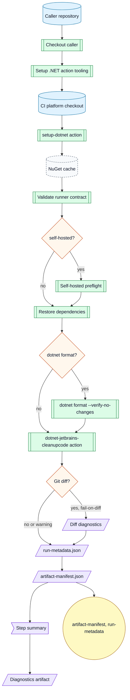

Preconditions:

- `solution` points to a solution or project in the caller repository.
- Lock files exist when `restore-locked-mode` is true.
- The selected runner can install or run the requested .NET SDK.
- The selected runner can install .NET 10 SDK for the CleanupCode action file script.
- Local tool restore requires `JetBrains.ReSharper.GlobalTools` in `.config/dotnet-tools.json`.
- `install-tool` requires network access to NuGet and should set `tool-version` for repeatability.

Side effects:

- Writes under `artifacts/`.
- Writes CleanupCode diagnostics under `artifacts/jetbrains-cleanupcode`.
- Excludes `artifacts/**/bin/**` and `artifacts/**/obj/**` from diagnostics uploads unless `runner.debug` is enabled.
- Reads and writes NuGet dependency cache when `enable-cache` is true.
- Optionally configures private NuGet restore credentials from `NUGET_AUTH_JSON`.
- Uploads diagnostics with `if: always()`.
- Runs `dotnet tool restore` when local tools exist.
- Runs CleanupCode, which may modify workspace files before the Git diff gate.
- Writes changed files and the applied CleanupCode diff preview to the log and summary.
- Reports a `dotnet format` failure even when CleanupCode also fails.
- Fails when CleanupCode creates a Git diff and `fail-on-diff` is true.

## .NET Test Workflow

`wf-dotnet-test.yml` checks out the caller repository.
It installs .NET 10 action tooling for coverage report file scripts, checks out this CI platform repository for shared actions, sets up the project SDK, restores dependencies, builds with a binlog, runs tests, optionally collects coverage, writes metadata, writes a manifest, writes a summary, and uploads diagnostics.
When `coverage-report` is true, it generates ReportGenerator HTML, Cobertura, Markdown, and text output from collected coverage.
When `coverage-pr-comment` is true on pull requests, it updates one coverage comment with the Markdown summary.
It does not run formatting, publish, or deploy.

Flow:

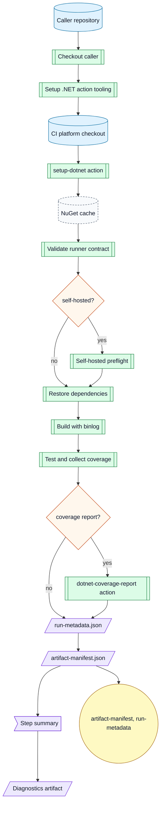

Preconditions:

- `solution` points to a solution or project in the caller repository.
- Lock files exist when `restore-locked-mode` is true.
- The selected runner can install or run the requested .NET SDK.
- Coverage report generation requires .NET 10 action tooling and NuGet access for `dotnet-reportgenerator-globaltool`.

Requirements:

| Requirement | Permission | Mode |
|---|---|---|
| GitHub CLI and `GH_TOKEN` for updating the pull request comment. | `pull-requests: write` | `coverage-pr-comment` |
| Coverage files matching the workflow coverage glob. | none | `coverage-report` |

Side effects:

- Writes under `artifacts/`.
- Excludes `artifacts/**/bin/**` and `artifacts/**/obj/**` from diagnostics uploads unless `runner.debug` is enabled.
- Excludes `artifacts/test-results/**` and `artifacts/coverage/**` unless `runner.debug` is enabled or the matching `upload-test-results` / `upload-coverage` input is true.
- Reads and writes NuGet dependency cache when `enable-cache` is true.
- Optionally configures private NuGet restore credentials from `NUGET_AUTH_JSON`.
- Uploads diagnostics with `if: always()`.
- Runs `dotnet tool restore` when local tools exist.
- Checks out this CI platform repository under `.ci/arkanis-ci`.
- May create or update one pull request comment when `coverage-pr-comment` is true.

## .NET Generated Code Workflow

`wf-setup-dotnet-generated-code.yml` checks out the caller repository.
It sets up .NET 10 action tooling, sets up the requested project SDK, restores local tools, restores dependencies, optionally builds the solution, runs generated-code commands, checks generated paths for tracked and untracked changes, writes diagnostics, writes a manifest, writes a summary, and uploads diagnostics.
It is based on CitizenId Wolverine generated handler verification.

Flow:


Preconditions:

- `solution` points to a solution or project in the caller repository.
- `commands` contains one or more Bash commands that regenerate source.
- `generated-paths` contains repository-relative generated source paths.
- Lock files exist when `restore-locked-mode` is true.
- Parallel commands must be safe to run together when `run-commands-in-parallel` is true.

Side effects:

- Runs commands that may modify workspace files.
- Writes under `artifacts/generated-code`.
- Ignores `bin/` and `obj/` Git pathspecs and excludes uploaded `artifacts/**/bin/**` and `artifacts/**/obj/**` unless `runner.debug` is enabled.
- Reads and writes NuGet dependency cache when `enable-cache` is true.
- Fails when generated paths change and `fail-on-diff` is true.

Example:

```yaml
jobs:
  wolverine:
    name: CitizenId.slnx @ ${{ github.head_ref || github.ref_name }}
    uses: ArkanisCorporation/ci/.github/workflows/wf-setup-dotnet-generated-code.yml@v1
    permissions:
      contents: read
    with:
      runs-on: ubuntu-latest
      runs-on-self-hosted: false
      dotnet-version: 10.0.x
      solution: CitizenId.slnx
      commands: |
        dotnet run --project src/CitizenId.Host.Discord/CitizenId.Host.Discord.csproj --no-build --no-launch-profile -- codegen write
        dotnet run --project src/CitizenId.Host.Web/CitizenId.Host.Web.csproj --no-build --no-launch-profile -- codegen write
      generated-paths: |
        src/CitizenId.Host.Discord/Internal/Generated/WolverineHandlers
        src/CitizenId.Host.Web/Internal/Generated/WolverineHandlers
      run-commands-in-parallel: true
```

## Node Lint Workflow

`wf-node-lint.yml` checks out the caller repository.
It checks out this CI platform repository for the shared `setup-node` action.
It installs dependencies, runs one lint command, writes metadata, writes a manifest, writes a summary, and uploads diagnostics.
It fails when `lint-command` is empty and the selected `lint-script` is missing.

Flow:

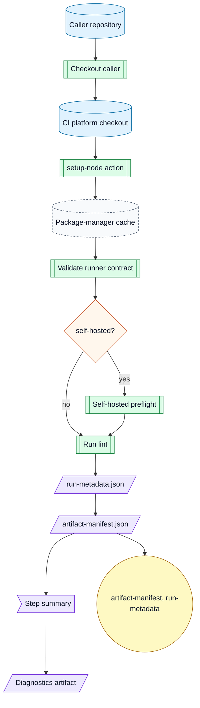

## Node Test Workflow

`wf-node-test.yml` checks out the caller repository.
It checks out this CI platform repository for the shared `setup-node` action.
It installs dependencies, runs one test command, writes metadata, writes a manifest, writes a summary, and uploads diagnostics.
It fails when `test-command` is empty and the selected `test-script` is missing.

Flow:

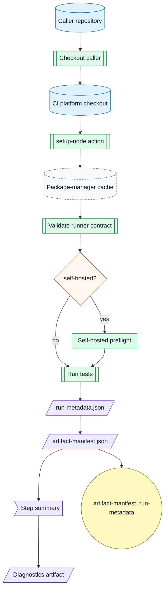

## Node Build Workflow

`wf-node-build.yml` checks out the caller repository.
It checks out this CI platform repository for the shared `setup-node` action.
It installs dependencies, runs one build command, writes metadata, writes a manifest, writes a summary, and uploads diagnostics.
It fails when `build-command` is empty and the selected `build-script` is missing.

Flow:

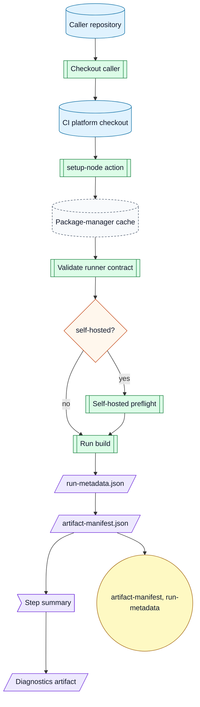

## GitHub Actions Lint Workflow

`wf-lint-github-actions.yml` checks out the caller repository, sets up Python with pipx, sets up Node.js with npm, records toolchain versions, and runs actionlint.
Use it to replace repository-local workflow lint jobs during migration.

Flow:

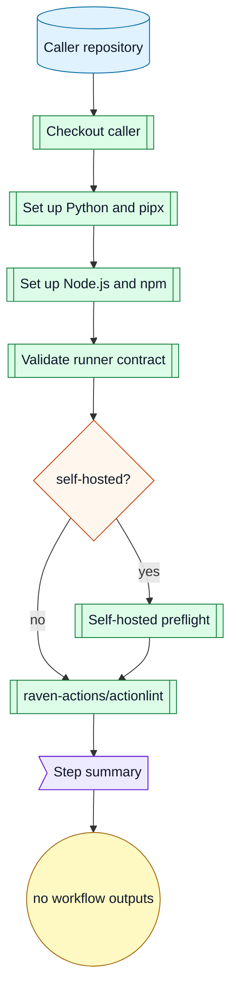

Preconditions:

- Caller workflows live under `.github/workflows`.
- The selected runner can run `actions/setup-python@v6` and install pipx.
- The selected runner can run `actions/setup-node@v6` or has Node.js 24 in the Actions tool cache.
- The selected runner can run `raven-actions/actionlint@v2`.

Side effects:

- Reads workflow YAML files.
- Reads and writes the actionlint binary cache when `enable-cache` is true.
- Records Python, pipx, Node.js, and npm versions in diagnostics and the step summary.
- Writes a short step summary.

Example:

```yaml
jobs:
  lint_workflows:
    name: workflows @ ${{ github.head_ref || github.ref_name }}
    uses: ArkanisCorporation/ci/.github/workflows/wf-lint-github-actions.yml@v1
    permissions:
      contents: read
    with:
      runs-on: ubuntu-latest
      runs-on-self-hosted: false
```

## Semantic Release Verification Workflow

`wf-verify-release-semantic.yml` runs semantic-release with Node 24 in dry-run mode.
It rejects `@semantic-release/exec` unless `allow-exec-plugin` is explicitly true.
It uses `contents: write` because semantic-release verifies Git tag push authorization even in dry-run mode.
It does not bind a GitHub environment.
Callers that use production-only semantic-release plugins should pass the same pinned plugins through `extra-plugins` so dry-runs validate the production release configuration.

Flow:


Preconditions:

- The caller grants `contents: write` so semantic-release can run its dry-run Git push authorization check.
- The caller repository contains valid semantic-release configuration.
- The selected runner can run Node.js and npm.

Side effects:

- Writes release diagnostics.
- Uploads diagnostic artifacts.
- Does not publish tags, releases, comments, packages, images, or deployments.

## Semantic Release Workflow

`wf-release-semantic.yml` runs semantic-release with Node 24 by default.
It rejects `@semantic-release/exec` unless `allow-exec-plugin` is explicitly true.
It binds the release job to `environment-name`.
It serializes release side effects per `environment-name` with `cancel-in-progress: false`.
Callers can pass pinned semantic-release plugins through `extra-plugins`, for example `semantic-release-major-tag@0.3.2` when repository config updates mutable major version tags such as `v1`.

Flow:

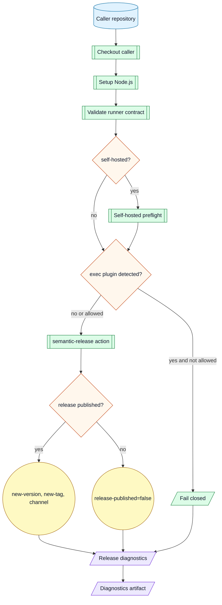

Preconditions:

- The caller grants release permissions.
- The caller passes or accepts the protected release environment name.
- The caller repository contains valid semantic-release configuration.
- Release branches are protected by caller policy.

Side effects:

- May create tags, mutable major tags, releases, changelog commits, comments, or release notes depending on repository semantic-release config.
- Uploads release diagnostics.

## Release Backpropagation Workflow

`wf-release-backpropagation.yml` creates a pull request from a release branch back to the default branch.
It can approve the PR using `PR_AUTOMATION_PAT` and enable auto-merge with GitHub CLI.
It binds the backpropagation job to `environment-name` so the environment can provide `PR_AUTOMATION_PAT`.
It serializes backpropagation per `default-branch` and `release-ref-name` with `cancel-in-progress: false`.
Use it only from trusted release workflows after semantic-release publishes a version.

Flow:

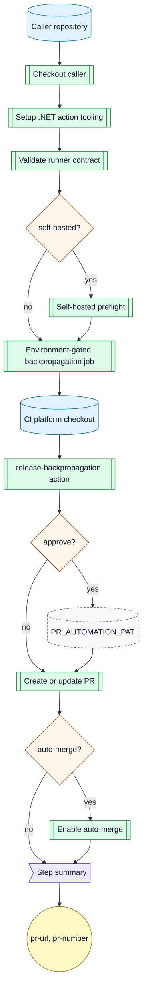

Preconditions:

- `new-version` is the semantic version that was published.
- `release-ref-name` is the release branch to merge back.
- `default-branch` is the target branch.
- `approve` requires `PR_AUTOMATION_PAT` from `environment-name` or the caller secret mapping.
- The selected runner has GitHub CLI and .NET 10 SDK.

Side effects:

- May create a pull request.
- May approve the pull request with the automation token.
- May enable auto-merge.

Example:

```yaml
jobs:
  release_backpropagation:
    name: ${{ needs.release.outputs.new-version }} @ ${{ github.event.repository.default_branch }}
    uses: ArkanisCorporation/ci/.github/workflows/wf-release-backpropagation.yml@v1
    permissions:
      contents: write
      pull-requests: write
    with:
      runs-on: ubuntu-latest
      runs-on-self-hosted: false
      environment-name: release-backpropagation
      new-version: ${{ needs.release.outputs.new-version }}
      release-ref-name: ${{ github.ref_name }}
      default-branch: ${{ github.event.repository.default_branch }}
      auto-merge: true
    secrets:
      PR_AUTOMATION_PAT: ${{ secrets.PR_AUTOMATION_PAT }}
```

## NuGet Publish Verification Workflow

`wf-verify-publish-nuget.yml` restores and packs one project without publishing it.
It uses read-only repository permissions and never requests NuGet secrets or OIDC.
It runs `dotnet-setversion` before packing by default so package assemblies and package metadata use the same release version.

Flow:

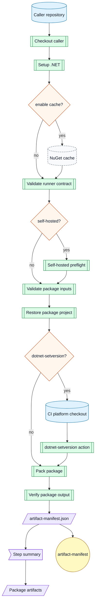

Preconditions:

- The project is packable.
- `version` is the semantic version to pack.
- `version` must be bare SemVer without a leading `v` when `dotnet-setversion` is true.

Side effects:

- Creates packages under `artifacts/nuget`.
- Reads and writes NuGet dependency cache when `enable-cache` is true.
- Checks out this CI platform repository under `.ci/arkanis-ci` for the `dotnet-pack-nuget` action.
- The pack action modifies matched `.csproj` files before packing when `dotnet-setversion` is true.
- Does not publish packages.

## NuGet Publish Workflow

`wf-publish-nuget.yml` restores and packs one project.
It delegates packaging to `dotnet-pack-nuget` and package pushes to `dotnet-publish-nuget`.
It publishes packages from environment-gated jobs with NuGet Trusted Publishing or API-key fallback.
Use the composite action caller pattern below when NuGet Trusted Publishing must match the consumer repository workflow file.
Trusted Publishing resolves the NuGet profile or organization from `nuget-user`, then caller secret `NUGET_USER`, then caller configuration variable `NUGET_USER`.
Prefer `nuget-user` or a repository, organization, or environment configuration variable because NuGet profile and organization names are normally not secret.
Use the secret fallback only when a caller deliberately treats the NuGet owner as sensitive.
Caller workflow `env` values are not passed into reusable workflows.
It can use `NUGET_API_KEY` when `trusted-publishing` is false.
It runs `dotnet-setversion` before packing by default so package assemblies and package metadata use the same release version.
It exposes `include-symbols` and `include-source` as independent package options.
When `include-symbols` is true, workflows pass `--include-symbols` and `-p:SymbolPackageFormat=snupkg` to `dotnet pack`.

Flow:

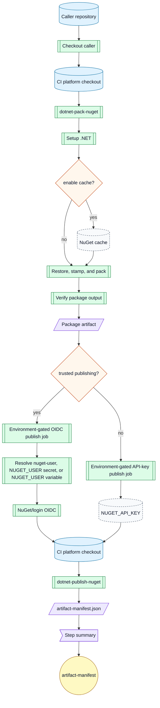

Preconditions:

- The project is packable.
- `version` is the semantic version to pack.
- `version` must be bare SemVer without a leading `v` when `dotnet-setversion` is true.
- Trusted Publishing requires a nuget.org policy that matches the workflow requesting the OIDC token.
- Trusted Publishing requires a NuGet profile or organization name from `nuget-user`, caller secret `NUGET_USER`, or caller variable `NUGET_USER`.
- API-key fallback requires the `NUGET_API_KEY` secret.
- Production publication binds the publish job to `environment-name`.

Side effects:

- Creates packages under `artifacts/nuget`.
- Reads and writes NuGet dependency cache when `enable-cache` is true.
- Checks out this CI platform repository under `.ci/arkanis-ci` for the pack and publish composite actions.
- The pack action modifies matched `.csproj` files before packing when `dotnet-setversion` is true.
- Publishes packages from the selected environment-gated publish job.

## NuGet Trusted Publishing Caller Pattern

Use a caller-owned protected publish job when nuget.org policy ownership must match the consumer repository workflow file.
Call `dotnet-pack-nuget` first, then run `NuGet/login`, then pass the login output directly to `dotnet-publish-nuget`.
Keep those steps in the same protected job so the temporary API key never crosses a job or workflow boundary.
Do not pass the temporary API key through job outputs, workflow outputs, artifacts, caches, or summaries.

Example:

```yaml
jobs:
  publish_nuget:
    name: NuGet
    if: ${{ needs.release.outputs.new-version != '' }}
    needs: release
    runs-on: ubuntu-latest
    environment: nuget
    permissions:
      contents: read
      id-token: write
    steps:
      - name: Checkout
        uses: actions/checkout@v7

      - name: Pack package
        uses: ArkanisCorporation/ci/.github/actions/dotnet-pack-nuget@v1
        with:
          project: src/Library/Library.csproj
          version: ${{ needs.release.outputs.new-version }}
          dotnet-setversion-working-directory: src/Library

      - name: NuGet login
        id: nuget-login
        uses: NuGet/login@v1
        with:
          user: arkanis

      - name: Push packages
        uses: ArkanisCorporation/ci/.github/actions/dotnet-publish-nuget@v1
        with:
          api-key: ${{ steps.nuget-login.outputs.NUGET_API_KEY }}
          package-directory: artifacts/nuget
```

## Matrix Caller Patterns

GitHub Actions supports `strategy.matrix` on jobs that call reusable workflows.
Use this when one release should fan out to independent packages, images, verification targets, or deployment targets.
Put target-specific values in `matrix.include` when each target needs a different project file, Dockerfile, image name, working directory, or environment.
Pass those values through `with` to the called workflow.
Set `fail-fast: false` for publish fan-out so one failed target does not cancel unrelated publish jobs.
Do not aggregate matrix reusable-workflow outputs directly.
Use the package, metadata, manifest, or deployment artifacts when a downstream job needs all matrix results.

Container image matrix example:

```yaml
jobs:
  publish_images:
    name: Image - ${{ matrix.target }}
    if: ${{ needs.release.outputs.new-version != '' }}
    needs: release
    strategy:
      fail-fast: false
      matrix:
        include:
          - target: web
            image: ghcr.io/arkaniscorporation/example-web
            dockerfile: src/Web/Dockerfile
            version-working-directory: src/Web
          - target: bot
            image: ghcr.io/arkaniscorporation/example-bot
            dockerfile: src/Bot/Dockerfile
            version-working-directory: src/Bot
          - target: gateway
            image: ghcr.io/arkaniscorporation/example-gateway
            dockerfile: src/Gateway/Dockerfile
            version-working-directory: src/Gateway
          - target: worker
            image: ghcr.io/arkaniscorporation/example-worker
            dockerfile: src/Worker/Dockerfile
            version-working-directory: src/Worker
    uses: ArkanisCorporation/ci/.github/workflows/wf-publish-container-dotnet.yml@v1
    permissions:
      contents: read
      packages: write
      id-token: write
      attestations: write
    with:
      runs-on: ${{ vars.RUNNER_DEFAULT || 'ubuntu-latest' }}
      runs-on-self-hosted: false
      image: ${{ matrix.image }}
      context: .
      dockerfile: ${{ matrix.dockerfile }}
      version: ${{ needs.release.outputs.new-version }}
      version-tag: ${{ needs.release.outputs.new-tag }}
      version-channel: ${{ needs.release.outputs.new-channel }}
      version-working-directory: ${{ matrix.version-working-directory }}
      environment-name: publish-ghcr
    secrets:
      REGISTRY_TOKEN: ${{ secrets.GITHUB_TOKEN }}
```

NuGet package matrix example:

```yaml
jobs:
  publish_packages:
    name: NuGet - ${{ matrix.package }}
    if: ${{ needs.release.outputs.new-version != '' }}
    needs: release
    runs-on: ${{ vars.RUNNER_DEFAULT || 'ubuntu-latest' }}
    environment: publish-nuget
    strategy:
      fail-fast: false
      matrix:
        include:
          - package: core
            project: src/Core/Core.csproj
            version-working-directory: src/Core
          - package: contracts
            project: src/Contracts/Contracts.csproj
            version-working-directory: src/Contracts
          - package: client
            project: src/Client/Client.csproj
            version-working-directory: src/Client
    permissions:
      contents: read
      id-token: write
    steps:
      - name: Checkout
        uses: actions/checkout@v7

      - name: Pack package
        uses: ArkanisCorporation/ci/.github/actions/dotnet-pack-nuget@v1
        with:
          project: ${{ matrix.project }}
          version: ${{ needs.release.outputs.new-version }}
          dotnet-setversion-working-directory: ${{ matrix.version-working-directory }}

      - name: NuGet login
        id: nuget-login
        uses: NuGet/login@v1
        with:
          user: ${{ vars.NUGET_USER }}

      - name: Publish package
        uses: ArkanisCorporation/ci/.github/actions/dotnet-publish-nuget@v1
        with:
          api-key: ${{ steps.nuget-login.outputs.NUGET_API_KEY }}
          package-directory: artifacts/nuget
```

Set `NUGET_USER` as a caller repository, organization, or `publish-nuget` environment configuration variable to share one NuGet owner across matrix children.
Use separate jobs or matrix entries when packages need different nuget.org policy owners or environments.

The same pattern applies to `wf-verify-publish-container-dotnet.yml`, `wf-verify-publish-nuget.yml`, verification workflows, and deployment workflows when each matrix child can run independently.
For deployment matrices, keep `environment-name`, namespaces, concurrency policy, and rollback ownership explicit per target.

## .NET Container Publish Verification Workflow

`wf-verify-publish-container-dotnet.yml` stamps .NET project versions, then builds with Docker Buildx without pushing.
It uses read-only repository permissions.
It disables SBOM and provenance emission so verification does not need OIDC or attestation permissions.
By default it uses a generated `type=gha` BuildKit cache when `enable-cache` is true and both `cache-from` and `cache-to` are empty.
Set `enable-cache` to false for cold image-build validation or runners without GitHub cache service access.
Set `cache-from` and `cache-to` when the caller needs registry cache, remote BuildKit portability, or a dedicated cache scope.
It serializes registry writes per `environment-name`, `registry`, and `image` with `cancel-in-progress: false`.

Flow:

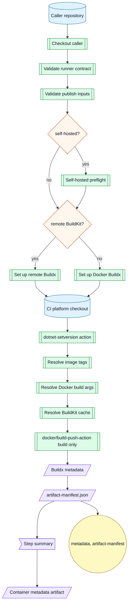

Preconditions:

- The runner can run Docker Buildx or reach the configured remote BuildKit endpoint.
- `version` is a required bare SemVer value without a leading `v`.
- `version-working-directory` contains .NET project files unless `version-recursive` is false and `version-project` is set.

Side effects:

- Builds container layers without pushing them.
- Reads and writes BuildKit cache when `enable-cache` is true.
- Checks out this CI platform repository under `.ci/arkanis-ci`.
- Optionally passes a generated NuGet config to Docker Buildx through `secret-files` when `nuget-build-secret` is true.
- Modifies matched `.csproj` files before Docker Buildx runs.
- Passes Docker build args to BuildKit; never put secrets in `build-args`.

## .NET Container Publish Workflow

`wf-publish-container-dotnet.yml` stamps .NET project versions, then uses Docker Buildx.
It supports GitHub-hosted Docker, self-hosted Docker, and remote BuildKit endpoints.
It always runs the `dotnet-setversion` composite action before Docker Buildx.
It appends a non-secret `VERSION=<version>` Docker build argument unless `build-args` already defines `VERSION`.
`version` is always the bare semantic version, such as `1.2.3`.
`version-tag` is only for image tags and may use the release tag form, such as `v1.2.3`.
`version-channel` adds both the raw channel tag and, by default, a `<channel>-latest` tag.
Use `extra-tags` for additional mutable tags such as `latest`.
By default it uses a generated `type=gha` BuildKit cache when `enable-cache` is true and both `cache-from` and `cache-to` are empty.
Set `enable-cache` to false for cold image-build validation or runners without GitHub cache service access.
Set `cache-from` and `cache-to` when the caller needs registry cache, remote BuildKit portability, or a dedicated cache scope.

Requirements:

| Requirement | Permission | Mode |
|---|---|---|
| Caller repository checkout and platform action checkout. | `contents: read` | always |
| Registry write token for pushed images. | `packages: write` for GHCR, or registry-specific write scope | always |
| Provenance metadata and attestations. | `id-token: write`<br>`attestations: write` | `provenance` or `sbom` |

Flow:

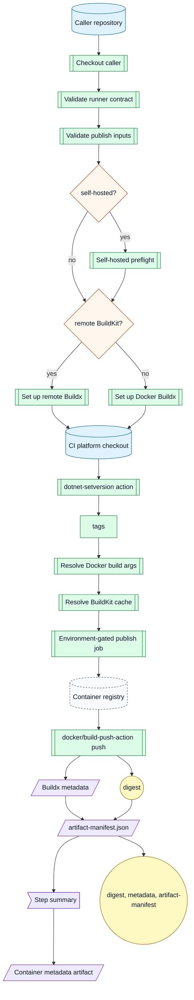

Preconditions:

- The runner can run Docker Buildx or reach the configured remote BuildKit endpoint.
- Registry credentials are available.
- Production publication binds the publish job to `environment-name`.
- `version` is a required bare SemVer value without a leading `v`.
- `version-working-directory` contains .NET project files unless `version-recursive` is false and `version-project` is set.
- Version stamping requires Bash, network access to restore actions/tool packages, and called-workflow `job` metadata support from reusable workflows.
- `extra-tags` accepts newline-delimited bare tag names or full image references.

Side effects:

- Builds container layers before pushing them.
- Reads and writes BuildKit cache when `enable-cache` is true.
- Pushes registry tags.
- May create mutable channel tags, channel-latest tags, and extra tags when configured.
- Checks out this CI platform repository under `.ci/arkanis-ci`.
- Optionally passes a generated NuGet config to Docker Buildx through `secret-files` when `nuget-build-secret` is true.
- Modifies matched `.csproj` files before Docker Buildx runs.
- Passes Docker build args to BuildKit; never put secrets in `build-args`.
- Emits a digest output for downstream deploys.

Example:

```yaml
jobs:
  publish_web:
    name: ${{ needs.release.outputs.new-tag || needs.release.outputs.new-version }} @ ghcr.io
    uses: ArkanisCorporation/ci/.github/workflows/wf-publish-container-dotnet.yml@v1
    permissions:
      contents: read
      packages: write
      id-token: write
      attestations: write
    with:
      runs-on: ubuntu-latest
      runs-on-self-hosted: false
      image: ghcr.io/arkaniscorporation/example-web
      context: .
      dockerfile: src/Web/Dockerfile
      version: ${{ needs.release.outputs.new-version }}
      version-tag: ${{ needs.release.outputs.new-tag }}
      version-channel: ${{ needs.release.outputs.new-channel }}
      extra-tags: |
        latest
      environment-name: container
    secrets:
      REGISTRY_TOKEN: ${{ secrets.GITHUB_TOKEN }}
```

## Aspire Kubernetes Deploy Verification Workflow

`wf-verify-deploy-k8s-aspire.yml` validates Aspire deployment inputs and tool availability without applying cluster changes.
It does not bind a GitHub environment or read `KUBE_CONFIG`.

Flow:


Preconditions:

- The AppHost project exists.
- The target namespace is a valid Kubernetes namespace.
- The selected runner can install .NET, kubectl, and Helm.

Side effects:

- Reads and writes NuGet dependency cache when `enable-cache` is true.
- Writes a verification manifest.
- Does not configure kube credentials, create namespaces, deploy, or use GitHub environments.

## Aspire Kubernetes Deploy Workflow

`wf-deploy-k8s-aspire.yml` deploys with `dotnet tool run aspire -- deploy`.
It accepts an optional `KUBE_CONFIG` secret.
If `KUBE_CONFIG` is omitted, the runner must already have a valid kube context.
It logs into GHCR before checkout and tool setup so Aspire deployment can push or pull registry content with the job token.
It serializes deployments per `environment-name` and `kubernetes-namespace` with `cancel-in-progress: false`.

Flow:

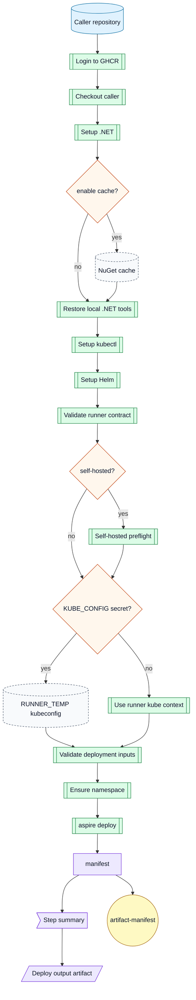

Preconditions:

- The runner can reach the Kubernetes API.
- The caller grants `contents: read` and `packages: write` to the reusable workflow job.
- GitHub Actions has write access to the GHCR package namespace used by the Aspire deployment.
- The AppHost project exists.
- The target namespace is a valid Kubernetes namespace.
- Production deployment binds the deploy job to `environment-name`.

Side effects:

- Logs in to `ghcr.io` with the job `GITHUB_TOKEN` and logs out during action cleanup.
- Creates the namespace when missing.
- Reads and writes NuGet dependency cache when `enable-cache` is true.
- Applies deployment changes.
- Writes deploy output under `output-path/environment-name`.

## Platform Selftest Workflow

`wf-platform-selftest.yml` validates this CI platform repository.
It runs actionlint 1.7.12, runs the static workflow contract validator, checks generated workflow input docs, and writes a step summary.
It is callable as a reusable workflow and directly runnable with `workflow_dispatch` for local `act` smoke tests.

Flow:

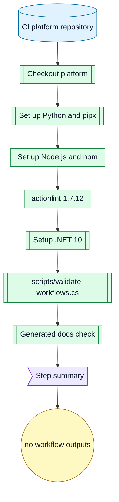

Preconditions:

- The repository contains `.github/workflows`, `.github/actions`, `schemas/workflow-inputs`, policy files, fixtures, and docs.
- The selected runner can install or run .NET 10.
- The selected runner can run `actions/setup-python@v6` and install pipx.
- The selected runner can run `actions/setup-node@v6` or has Node.js 24 in the Actions tool cache.
- The selected runner can run `raven-actions/actionlint@v2` with actionlint `1.7.12`.
- Local validator runs still use a system `actionlint` when available.

Side effects:

- Reads workflow, action, schema, fixture, policy, and doc files.
- Records Python, pipx, Node.js, and npm versions in the step summary.
- Writes a step summary.
- Does not publish, deploy, or request secrets.

Example:

```yaml
jobs:
  selftest:
    name: platform @ ${{ github.head_ref || github.ref_name }}
    uses: ArkanisCorporation/ci/.github/workflows/wf-platform-selftest.yml@v1
    permissions:
      contents: read
    with:
      runs-on: ubuntu-latest
      runs-on-self-hosted: false
```
